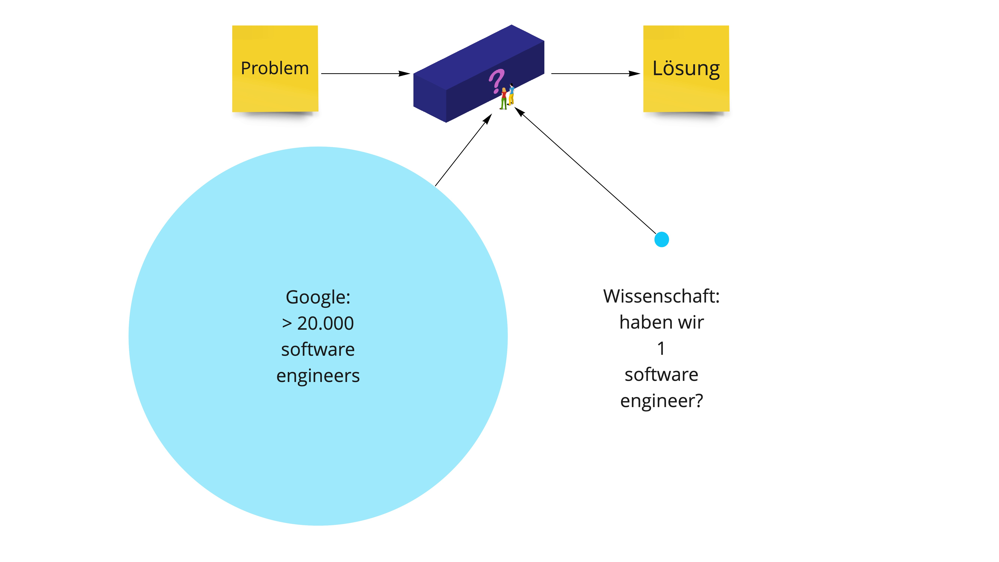
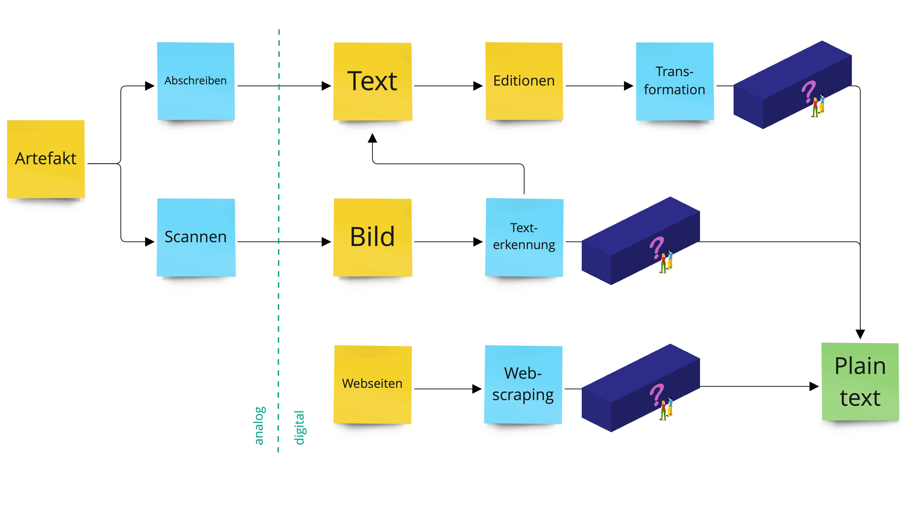

---------

Wir bauen im Rahmen des DFG-Projekts "Future e-Research Support in the Humanities" zur Förderung von *digitaler* und *computationaler* **Werkzeugkompetenz** (*tool literacy*) in den Geistes- und Kulturwissenschaften an Universitätsbibliothek unter Beteiligung der Lehrstühle für *Digital History* (Inst. f. Geschichte) und *Information Processing and Analytics* (Inst.f. Bibliotheks- und Informationswissenschaften) der Humboldt-Universität zu Berlin einen **prototypischen *Scholarly Makerspace*** auf (2022--25).

# Ein prototypischer Scholarly Makerspace?!
## Ein Makerspace?

>Im Wesentlichen geht es bei der Makerbewegung um das Teilen von **Räumen**, **Ressourcen** und **Wissen** innerhalb einer **Gemeinschaft**. Diese Ressourcen stehen Einzelpersonen privat oft nicht zur Verfügung. Die Ermöglichung des Zugangs für alle, stellt so einen zentralen Faktor für eine offene und demokratische Gesellschaft dar. [@Heinzeletal2020Einleitung, 2]

::: notes

Damit sind Makerspaces 
    - *Lernorte*
    - wichtige Schnittstelle zwischen **formellem** und **informellem** Lernen [@Heinzeletal2020Einleitung, 1]

:::

## Ein Makerspace, aber für was?

::: notes

- Werkstätten für Selbermacher:innen
    + Fab Lab, 
- „Makerspace“ hieß  ursprünglich auch die erste kommerziell betriebene Werkstatt bei der 3D-Drucker  gemietet und genutzt werden konnten (HATCH 2013)

:::

## Ein Makerspace, aber für was?

## Ein **Scholarly** Makerspace!

::: columns
:::: column

::::
:::: column

::::
:::

## Ein **Scholarly** Makerspace als Lernort für die digitale Werkzeugkompetenz in den Humanities

Fokus auf **digitale** und **computationelle** Aspekte zeitgenössischer Geistes- und Kulturwissenschaften

- durch Forschungsfragen getrieben
- die Auswirkungen der Digitalität auf den Erkenntnisprozess untersuchend
- die gesellschaftlichen Auswirkungen und Rahmenbedingungen reflektierend

::: notes

- durch Forschungsfragen getrieben:
    + Wie lassen sich genuin digitale, kulturelle Artefakte für die Zeitgeschichte des 21. Jahrhunderts einsetzen
    + Wie lassen sich (sehr) große Corpora mit *distant reading* statistisch valide erschließen?
    + Wie lassen sich Soziale Medien für die Untersuchung gesellschaftlichen Wandels in repressiven Systemen nutzen?
- die Auswirkungen auf den Erkenntnisprozess untersuchend:
    + Welche Auswirkungen haben OCR Algorithmen und Normalisierung auf die Qualität meines Korpus?
    + Was ist die Auswirkung von abstrahierenden Operationalisierungen für die quantitative Auswertung?
- die gesellschaftlichen Auswirkungen untersuchend?
    + Wie hoch ist der Verbrauch natürlicher Ressourcen für das Training einer KI auf die Klassifizierung von Abbildungen in mittelalterlichen Handschriften?
    + Was ist mit dem Einsatz von Sklaverei-ähnlichen Zuständen für die Herstellung und Erhalt der notwendigen technischen Infrastrukturen?
    + Welche Folge hat eine auf Beiträge in den Sozialmedien trainierte KI für die Hausratversicherungen in sozialen Brennpunkten?

:::

## Digitale Werkzeugkompetenz in den Humanities?

>It is our position that the "digital" cannot be understood as a separate domain of culture. If we actually examine the digital [...] we see that today digital information processing is present in every aspect of our lives [@CPCAbout].

- Die Unterscheidung zwischen **digital** und **analog** bzw. hergebrachten Ansätzen ist bedeutungslos geworden [@Berry+2017]
- Sämtliche Aspekte der Forschung sind bereits immer durch Computer re-medialisiert

::: notes

Aspekte / Komponenten computationeller Forschung in den Geistes- und Kulturwissenschaften [@Drucker2021DHCoursebook]

1. Erstellung, Aufbereitung **digitaler Materialien**
2. **computationelle Be- / Verarbeitung** dieser Materialien
3. **Präsentation** der Ergebnisse, der Prozesse und der Materialien

:::

## Digitale Werkzeugkompetenz in den Humanities?

Maschinen sind auf dem Weg überzeugende Schöpfer werden ...

::: columns
:::: column

### text2text

Mit [you.com](https://you.com/search?q=how+to+write+well&&tbm=youwrite&cfr=write&)

>The humanities are under pressure. In an age of big data and computational power, the traditional methods of hermeneutics--close reading and interpretation--seem quaint. New approaches are needed to engage with the digital world, and one promising avenue is the creation of a prototypical scholarly makerspace.
>
>A makerspace is a place where people can come together to create things using technology. They are often open-ended environments where people can experiment and tinker with new ideas. This type of environment is ideal for exploring digital and computational tools, as well as for developing new ways of thinking about the humanities.

<!-- >Digital technology is revolutionizing the way we live, work, and communicate. In particular, digital tools are transforming the humanities by providing new ways of accessing and analyzing information. As academics in the humanities, we need to be literate in these tools in order to keep up with the changing landscape of our discipline.

>The digital transformation presents many challenges for us as scholars. For one thing, we must learn how to use new software and hardware platforms that enable us to access and analyze data more efficiently. Additionally, we need to develop new methods for conducting research that take advantage of the unique capabilities of digital technologies. Finally, we must grapple with the ethical implications of using these technologies in our work.

>Despite these challenges, there are many reasons why developing digital tool literacy is essential for scholars in the humanities today. First and foremost amongst these is that it allows us to do our jobs better – plain and simple. With a better understanding of how to use digital technologies effectively, we can conduct research more efficiently and produce scholarship that is more impactful. Additionally, by being digitally literate we set ourselves apart from other scholars who may not have kept pace with the latest developments. Finally ,as society becomes increasingly digitized it is important that those of us working in those digital spaces have a strong foundation in their use. Only through developing our digital tool literacy can we continue to prosper as academics in the humanties field -->

::::
:::: column

### text2image

Mit OpenAIs [DALL-E](https://openai.com/blog/dall-e/)

::::
:::

::: notes

- DALL-E bassiert auf den GPT (Generative Pre-trained Transformer) Modellen von OpenAI
- GPT-3 wird auch zur Textgenese genutzt
- [Stable Diffusion](https://en.wikipedia.org/wiki/Stable_Diffusion)

:::

## Digitale Werkzeugkompetenz in den Humanities!

Stärkung der *tool literacy* (Werkzeugkompetenz) für:

+ **Teilhabe** an der Digitalität durch computationelle Methoden,
+ kritische **Reflexion** über ein neues epistemisches Paradigma,
+ Genese **neuer Erkenntnisse** {--für die Geistes- und Kulturwissenschaften--}

## Aber **Making** ?

>Do artefacts have politics? [@Winner+1980]

<!-- >Do politics have artefacts? [@DunbarHester2014LowPower] -->

>To use [...] tools well, we must, in some real sense, understand them better than the tool makers. [...] The best kind of tools are therefore the ones that we make ourselves. [@Tenen2016BluntInstrumentalism, 85]

::: columns
:::: column

### Making

- Experimentieren, Tüfteln, Ausprobieren, Werkeln 
- Selbstermächtigung mit dem Ziel der (Wieder)Aneignung der Produktionsmittel

::::
:::: column

### Maker turn

Kreativität von Design, Herstellung und Erfahrung von (digitalen) Objekten als From von Wissenschaft

::::
:::

::: notes

- Grundsatz: Werkzeuge und Methoden sind mit Machtverhältnissen verwoben
- Geschichte
    + 1970er Kalifornien: kooperative Werkstätten
    + Recht auf Reparatur
    + DIY: do it yourself culture
    + "Maker Movement Manifesto" von Hatch (2013)
        * make, share, give, learn, tool up, play, participate, support, change
- bezieht sich auf [@Wythoff2022MinimalComputing], der die beiden Fragen verknüpft hat
    + Do artefacts have politics? [@Winner+1980]
    + Do politics have artefacts? [@DunbarHester2014LowPower]
- Kritik an Maker culture als omnipotenter maskuliner Raum:
    - >knowledge of circuitry is often conflated with (superheroic) command over people, situations, and things. In present-day “maker” cultures, consider the ubiquity of remarks such as “getting under the hood” or “knowing the nuts and bolts,” which tend to fuse logic with mastery, control with masculinity, engineering with rationality, and programming with revealing. [@Sayers2017Introduction, 3]

:::

## Ein prototypischer Scholarly Makerspace

::: columns
:::: narrow

::::
:::: wide

- Fokus auf Übertragbarkeit und Nachnutzbarkeit
    + Nur das absolut Notwendige selber machen
    + Nutzung bestehender offener Infrastrukturen
    + Modulares System
    + Dokumentation, Dokumentation, Dokumentation
    + Open Data und Open Science von Anfang an
- Begleitende Studien
    + Forschungs- und Projektseminare

::::
:::

# Serviceportfolio
## Wer sind unsere Zielgruppen?

Forscher_innen aller Karrierstufen ab der Promotionsphase

::: columns-3
:::: column

### Typ 1

Keine / geringe Kenntnisse aber Interesse an Digital Humanities

::::
:::: column

### Typ 2

Detaillierte Vorstellungen aber mangelnde Kenntnisse für konkrete Umsetzung

::::
:::: column

### Typ 3

Detaillierte Kenntnisse aber mangelnder Zugang zu Infrastrukturen

::::
:::

## Was bieten wir an?
### Hilfe zur Selbsthilfe

- Infrastruktur und Resourcen für eigenes Arbeiten
    + wöchentliche Einführungen in den Scholarly Makerspace
    + offene Materialien und Infrastrukturen für die Nachnutzung und Erweiterung
    <!-- + Zugang zu technischen Infrastrukturen der HU (z.B. CMS) -->
- "Sprechstunden" bzw. gemeinsames Experimentieren
    + Drop-in
    + Offene Sprechstunde
    + gezielte Beratung
- Vernetzung in die DH Community in Berlin und beyond
    + Community hours für den Austausch
    + Veranstaltungskalender

## Was bieten wir an?
### Einen Lernort

Der *Scholarly Makerspace* ist ab dem 14. November täglich von 10 bis 14 Uhr geöffnet

::: columns
:::: column

::::
:::: column

::::
:::

::: notes

- Makerspace als Lernort
- Wichtig beim Scholarly Makerspace ist nach wie vor der physische Raum, in dem letztlich Austausch und Vernetzung der Community stattfinden können
+ Herausforderung: 
    * bzgl. Des Bibliotheksbau in Berlin (Grimm-Zentrum) die Bibliothek traditionell gedacht und geplant wurde, d.h. diese neuen Räume müssen erst geschaffen werden (nicht frei von Konflikten abläuft)
+ Anforderungen: angenehme Atmosphäre
        * Platz
        * Licht
        * Schallschutz
        * Gruppenarbeitsplätze
        * "Werkbänke"

:::

## Was bieten wir an
### Erfahrungen und Wissen

::: columns-3
:::: column

::::
:::: column

::::
:::: column

::::
:::

::: notes

- wichtig bei Bereitstellung für uns, diese nicht hierarchisch zu denken
    + wir das Personal sind nicht die Experten, die frontal erklären
- >To say, “I can do first aid,” is to underscore our entanglement with circuitry. And to say, “I don’t know all the circuitry,” at least implies the impossibility of such knowledge. That is, we can reject the autonomy or privacy of technologies without supposing we know them completely. Although we may understand how something works, we may not apprehend how or under what conditions it was made. [@Sayers2017Introduction, 2]
- >knowledge of circuitry is often conflated with (superheroic) command over people, situations, and things. In present-day “maker” cultures, consider the ubiquity of remarks such as “getting under the hood” or “knowing the nuts and bolts,” which tend to fuse logic with mastery, control with masculinity, engineering with rationality, and programming with revealing. [@Sayers2017Introduction, 3]

:::

## Was bieten wir an?
### Infrastruktur und Resourcen

::: columns
:::: column

### Werkzeuge

- Metaphorische, physische Werkzeuge, Werkzeugkisten und -regale
- Modularisierte computationelle Werkzeuge
- Verweise auf Literatur, Tutorials, Use cases

::::
:::: column

### Infrastruktur

- Dockingstationen für Laptops
- Nutzbarmachung vorhandener Resourcen an der HU
    + GPU-Rechner
    + Server des CMS
    + 3D Drucker :-)

::::
:::

::: notes

Hinsichtlich der Ressourcen denken wir den Makerspace zweiteilig:

1. zum einen wollen wir Infrastrukturen vor Ort zur Verfügung stellen (Hardware, mit der gearbeitet werden kann, aktuell Dockingstations, kann durchaus erweitert werden z.B. 3D-Drucker, wenn Bedarf da ist), aber auch vorhandene Infrastrukturangebote an der HU nutzbar machen (Zugang zu GPU-Rechenkapazitäten, Server des CMS, etc.)
2. zum anderen aggregieren wir bei uns digitale Werkzeuge, welche im geisteswissenschaftlichen Forschungsprozess zum Einsatz kommen
    * wobei wir Werkzeuge metaphorisch als physisch denken und diese entsprechend nach Werkzeugkisten  und -regale systematisieren
    * daneben gibt es Werkzeuganleitungen, die aus Literatur, Tutorials und Best Practices bestehen

:::

## Was bieten wir nicht an?

- Wir haben keine 3D Drucker
- Wir schreiben keine Anträge
- Wir setzen keine Projekte um
- Wir machen keinen dauerhaften Support
- Wir bauen keine Webseiten

::: notes

- Wir können Kontakt zu Leuten mit 3D Druckern herstellen

:::

# Wie arbeiten wir? {data-background-image="../assets/images/blackbox/black-box_question-mark-people-c_blue.png" data-background-size="90%"}
## Die Blackbox

>The term black box [...] is a device or system that, for convenience, is described solely in terms of its inputs and outputs. One need not understand anything about what goes on inside such black boxes. One simply brackets them as instruments that perform certain valuable functions. [@Winner+1993, 365]

::: notes

+ Schutz von Betriebsgeheimnissen
+ Nutzerfreundlichkeit

:::

## Was haben wir um sie zu öffnen?

## Minimal computing

>Das Haus ist gebaut aus den Steinen, die vorhanden waren [@Brecht1967SchlechteZeiten].

Im Sinne des *minimal computing* ist das Spannungsfeld aus "was brauchen wir?" und "was haben wir?" handlungsleitend. [@Gil+2016]

- Kontextabhängig
- Hilfe zur Selbsthilfe
- Fokus auf **methodische Zugänge** mit beispielhaften Implementation

::: notes

- die minimale Lösung ist unter den Bedingungen der Wissenschaft, die einzig machbare
- muss im Einklang mit guter Wissenschaftlicher Praxis stehen
- Nutzer_innen sollen ermächtigt werden
- Lösungen müssen nach dem Verlassen des Makerspaces funktional bleiben
- *vorhanden* reicht im Sinne Heideggers nicht, Dinge müssen *zuhanden* sein

:::

## Was haben wir?

::: notes

- Beispielhafter Prozess für den Einsatz von Software

:::

# Operationalisierung {data-background-image="../assets/images/blackbox/blackbox_makerspace-inside.png" data-background-size="90%"}

## Forschungsprozess

::: notes

-  dieser Abschnitt dient der ersten Entzauberung
-  Aufwand für Datenerfassung
-  Kräfteverhältnis zwischen Platformen und Wissenschaft

:::

## Wir groß sind die Blackboxes?
### Unsere Erwartungen und Wünsche

## Wir groß sind die Blackboxes?
### Die (bittere) Realität

## Beispiel: Werzeugliste

>Wir bauen einen *Scholarly Makerspace* auf und wollen eine **Liste von Werkzeugen** kuratieren, die auf der **Häufigkeit** ihrer **Benutzung in der Forschung** beruht (Unsere eigene User Story).

## Datenerfassung: konzeptionell
### Eingabe ---> Verarbeitung ---> Ausgabe

## Datenerfassung: Werkzeugliste
### Eingabe ---> Verarbeitung ---> Ausgabe

## Datenerfassung: Web scraping
### Eingabe ---> Verarbeitung ---> Ausgabe

# Schluß / Danke!
## Literatur {#refs}