## Willkommen

::: columns-3
:::: column

### AI Skills

"AI Skills" (BMBF, 2022--25)

::::
:::: column

### Digital History

Torsten Hiltmann

Lehrstuhl für Digital History (seit 2020)

[dhistory.hypotheses.org](https://dhistory.hypotheses.org)

::::
:::: column

### Scholarly Makerspace

"Future e-Research Support in the Humanities\" (DFG, 2022--25)

[makerspace.hypotheses.org](https://makerspace.hypotheses.org/)

::::
:::

# Was ist ChatGPT?
## Was ist ChatGPT?

::: columns
:::: column

>ChatGPT ist der Prototyp eines Chatbots, [...] der auf **künstlicher Intelligenz** (KI) beruht. Er wurde von dem US-amerikanischen Unternehmen OpenAI entwickelt und im November 2022 veröffentlicht. Um [...] das dahinter stehende **Modell** zu verbessern, wird die KI von ChatGPT fortlaufend durch menschliches Feedback **trainiert**.
<cite>[Wikipedia](https://de.wikipedia.org/wiki/ChatGPT)</cite>

::::
:::: column

<pre class="mermaid">
flowchart RL
    comp2((OpenAI\n2015)) --> gpt[(GPT: Generative\nPre-trained\nTransformer\n2018)]

    gpt --> chatgpt{ChatGPT\n2022}

    click chatgpt "https://chat.openai.com/" _blank
</pre>

::::
:::

# KI?  Was soll das sein?!
## Künstliche Intelligenz (KI / AI)

::: columns
:::: column

![Enthüllung einer Gedenktafel im Darthmouth College, Quelle: [@Belser2006AIConferenceReturns]](../assets/images/ai/ai-plaque-darthmouth-reveal.jpg){#fig:plaque}

::::
:::: column

- "Künstliche Intelligenz" ist ein **altes** Buzzword, das sich findige Wissenschaftler 1956 für einen Förderantrag ausgedacht haben.
- Es ist besser von **maschinellem Lernen** (ML) zu sprechen, das z.T. auf **künstlichen neuronalen Netzen** beruht.

::::
:::

::: notes

- Dartmouth Conference im Sommer 1956 
- sechswöchiger Workshop mit dem Titel Dartmouth Summer Research Project on Artificial Intelligence
- von der Rockefeller Foundation gefördert
- "In 1955, John McCarthy, then a young Assistant Professor of Mathematics at Dartmouth College, decided to organize a group to clarify and develop ideas about thinking machines." <https://en.wikipedia.org/wiki/Dartmouth_workshop>

:::

## Maschinelles Lernen (ML)

<!-- <pre class="mermaid">
---
title: Blackbox KI
---

flowchart LR
    Input --&gt; bb[["Künstliche Intelligenz"]] --&gt; Output
</pre> -->

::: columns
:::: column

### Was?

- Algorithmen, die auf der Basis sehr großer Datensätze statistische Modelle anlegen (trainieren)
- Es gibt verschiedenste Arten des ML
    - Supervised
    - unsupervised
    - transfer learning
    - deep learning
    - reinforcement learning

::::
:::: column

### Wie?

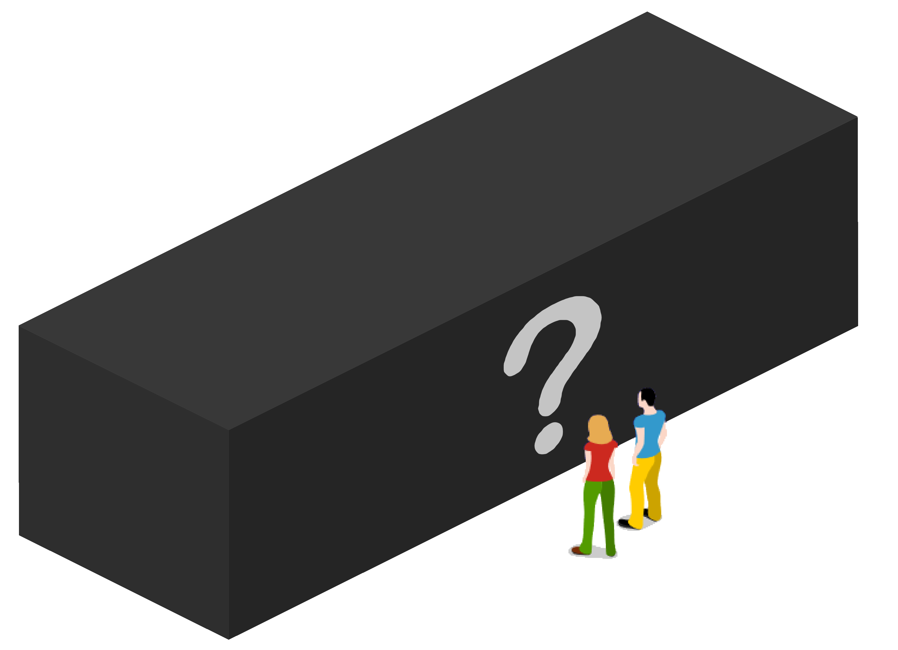

::::
:::

::: notes

- ist nicht neu

:::

## Large Language Models (LLMs)

::: columns
:::: wide

### Was?

- **Modelle** [@Stachowiak1973AllgemeineModelltheorie]: 
    + Abbildung
    + Verkürzung/Reduktion
    + Zweckbindung 
- **Sprach**Modelle: statistische Wahrscheinlichkeitsverteilung von Tokens in einer Sequenz innerhalb eines Korpus
    + werden auf Basis eines Korpus von Texten *trainiert*
    + sind "stochastische Papageien" [@BenderEtal2021StochasticParrots]
- **Große** Sprachmodelle: 
    + Hunderte Milliarden von Parametern
    + Benötigen hunderte GB Speicherplatz

::::
:::: narrow

### Beispiel

{#fig:ios-keyboard}

::::
:::

::: notes

- Modelle haben drei grundlegende Eigenschaften [@JannidisFlanders2019GentleIntroduction, 28; @Stachowiak1973AllgemeineModelltheorie]
    1. **Mapping**: Ein Model ist ein Model von etwas
    2. **Reduction**: Ein Model ist nicht das Original sondern bildet für die Untersuchenden wichtige Aspekte ab
    3. **Purpose**: Ein Model hat einen Zweck: es soll von jemanden für etwas benutzt werden
+ "stochastic parrots" [@BenderEtal2021StochasticParrots, 617]
    * Wer trifft die Auswahl?  
    * Welche sozio-kulturellen Biases perpetuieren sich hier?
- Beispiel GPT-3 (Generative Pre-trained Transformer)
    + 2048-token-long context and 175 billion parameters (requiring 800 GB of storage).
:::

## Transformer Modelle {#transformer-2}

::: columns
:::: column

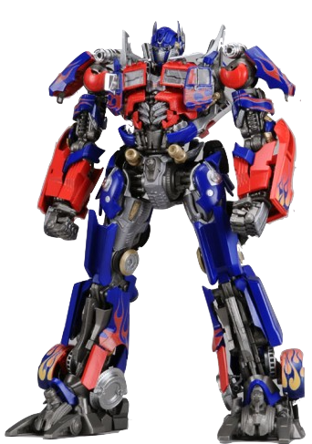{#fig:transformer-model}

::::
:::: column

- Sind Anwendungen von deep learning, die vor allem für Natural Language Processing (NLP) entwickelt wurden
- Prinzip:
    + Die Inputsequenz wird in Tokens (Wörter, Sätze etc.) zerschnitten
    + Tokens werden in Vektoren *übersetzt* (Word embedding), bei dem Informationen über die Position des Tokens in der Inputsequenz erfasst wird. 
- Beispiele: 
    - `Königin - weiblich = König`
    - `Arzt + weiblich = Krankenschwester`

::::
:::

::: columns-3
:::: column

- [ChatGPT](https://chat.openai.com/)
- [Rytr](https://rytr.me/)
- [You](https://you.com/search?q=how+to+write+well)

::::
:::: column

- [Moonbeam](https://www.gomoonbeam.com/ )
- [Elicit](https://elicit.org/)
- [Lex](https://lex.page/)

::::
:::: column

- [R Tutor](http://rtutor.ai) <!-- : Zum Erlernen von R-->
- [GitHub CoPilot]()
- [OpenAI detector](https://huggingface.co/openai-detector)

::::
:::

::: notes

>Ein Transformer besteht im Wesentlichen aus in Serie geschalteten Kodierern (Encoder) und in Serie geschalteten Dekodierern (Decoder).[2][3][4] Die Eingabesequenz wird durch eine sogenannte Embedding-Schicht in eine Vektorrepräsentation überführt. Die Gewichte der Embedding-Schicht werden während des Trainings angepasst. Im Falle des Transformers kommt zusätzlich eine Positionskodierung zum Einsatz, wodurch die sequentielle Abfolge der Wörter berücksichtigt werden kann. Ein Wort erhält somit zu Beginn eines Satzes eine andere Repräsentation als am Ende.[3]

>Die Eingabesequenz wird in der Vektorrepräsentation einer Serie von Kodierern übergeben und in eine interne Repräsentation überführt. Diese interne Repräsentation bildet die Bedeutung der Eingabesequenz abstrakt ab[4] und wird durch die Dekodierer in eine Ausgabesequenz übersetzt.[4] Die Eingabesequenz wird hierbei in Batches verarbeitet, wobei die Länge der Kodierer-Dekodierer-Pipeline die maximale Länge der Eingabesequenz beschränkt.[3] Je nach Größe des Netzwerks können beispielsweise einzelne Sätze oder auch ganze Absätze verarbeitet werden. Bei Eingabesequenzen, welche kürzer sind als die Länge der Kodierer-Dekodierer-Pipeline, wird Padding genutzt, um die Eingabesequenz aufzufüllen.[3]

:::

# ChatGPT
## ChatGPT

::: columns
:::: column

- Ein "Chatbot" auf der Basis von GPT-3
+ Entwickelt von OpenAI
+ unterstützt alle im Internet dominant vertretenen Sprachen

::::
:::: column

+ Veröffentlicht am 30 November 2022
- 1 Mio Nutzer_innen in 5 Tagen

::::
:::

<pre class="mermaid">
flowchart RL
    comp2((OpenAI\n2015\nnonprofit)) ==> gpt[(GPT: Generative\nPre-trained\nTransformer\n2018)]
    pers1[Elon Musk] -.-> |co-funded| comp2
    pers2[Peter Thiel] -.-> |co-funded| comp2
    comp4(("Amazon Web\nServices (AWS)")) -.-> |co-funded| comp2

    gpt ==> comp5((OpenAI\n2019\nfor profit))
    comp5 ==> gpt3[(GPT-3\n2020)]
    comp3((Microsoft)) -.-> |invested| comp5
    comp3 <-..- |exclusive use| gpt3

    gpt3 --> dalle{DALL-E\n2021}
    gpt3 ===> chatgpt{ChatGPT\n2022}
    comp4 --> |hosts| data1[("Common Crawl\ndata set\n2011-")]
    data1 --> |training\nset for| gpt

    comp6((Common Crawl\nnonprofit)) --> |provides| data1

    click chatgpt "https://chat.openai.com/" _blank
    click dalle "https://openai.com/blog/dall-e/" _blank
    click comp6 "http://commoncrawl.org/" _blank
</pre>

## Wer kann das benutzen?

- Die Nutzung ist **zunächst** kostenfrei nach Anmeldung und in der Kapazität begrenzt
- Dient der Verbesserung der Modelle und Produktentwicklung

::: columns
:::: column

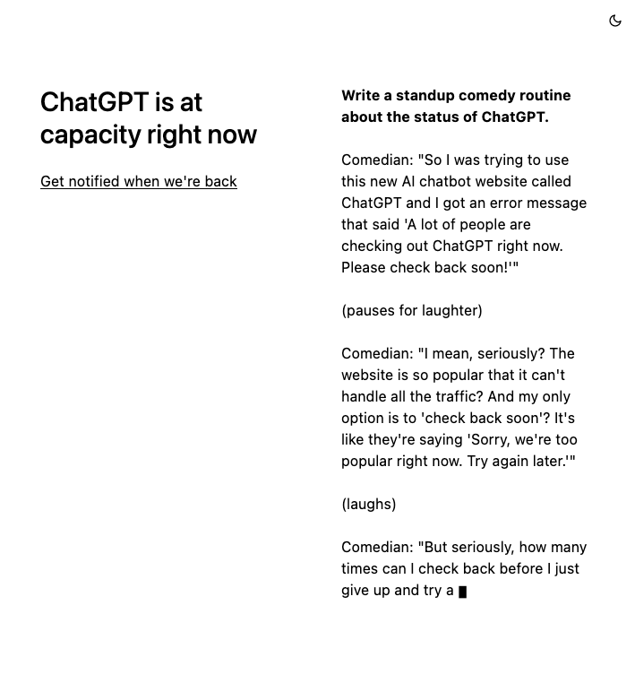{#fig:chatgpt-max}

::::
:::: column

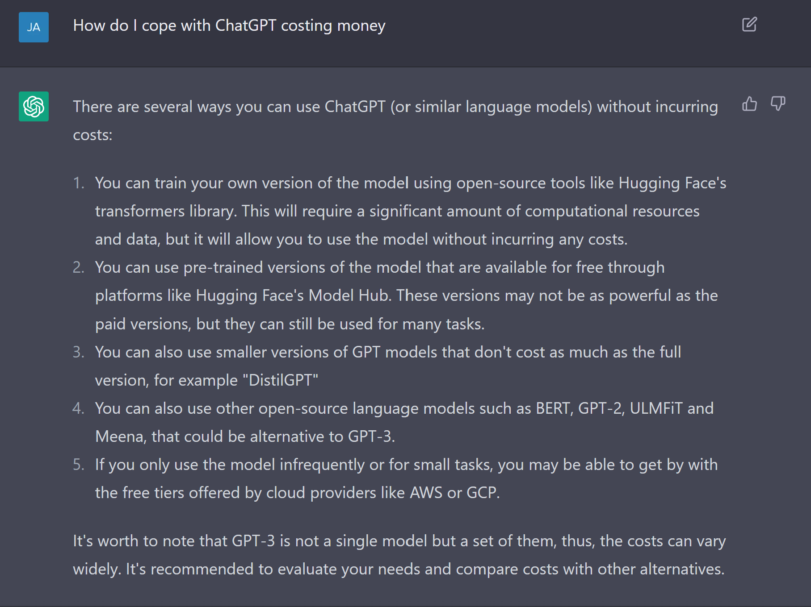{#fig:chatgpt-cost}

::::
:::

# Anmerkungen vom Grantler {data-background-image="../assets/images/ai/grantler.png" data-background-size="90%"}
## LLMs sind Bullshit-Artists

::: columns
:::: column

- Konzepte wie "Wahrheit" oder "Korrektheit" sind nur nebensächlicher Beifang
- Optimiert werden "Menschenähnlichkeit" und "Menschengefälligkeit" 

::::
:::: column

![[@Frankfurt2005Bullshit]](../assets/images/ai/on-bullshit.jpg)

::::
:::

## Wer ist der Urheber?  Wer ist zuständig?

::: columns
:::: column

- Wo ist die Grenze zwischen Schöpfung und Remix der Ursprungsdaten?
- "Zufallsausgaben" mit schutzwürdigen und privaten Informationen
- Wie Training auf eigenen Schöpfungen kontrollieren?

::::
:::: column

::::
:::

## It is a riddle...

>It is a riddle... wrapped in a mystery...inside an enigma

<cite>Winston Churchill>

::: columns
:::: column

LLMs sind Blackboxes...

- ...gefüttert mit unbekannten Daten...
- ... mit automatisierten (vor) Filtern....
- ...potentiellen manuellen Antwortmustern...

::::
:::: column

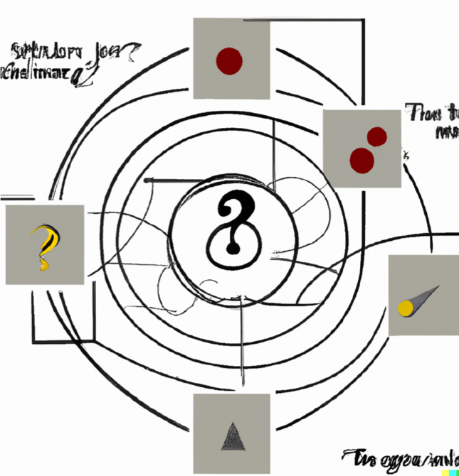

::::
:::

# Beispiele
## Reflektierter Umgang mit KI in der Schule  Deutschunterricht

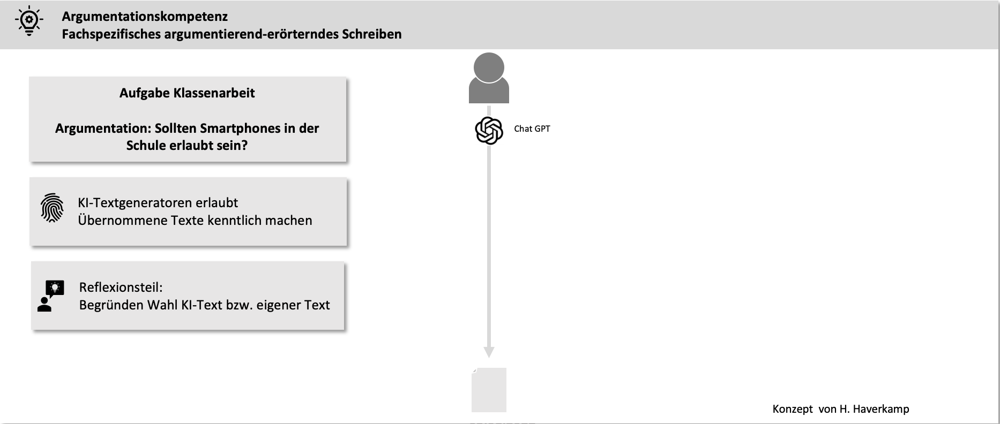

::: notes

Digitale Entwicklung im Bildungswesen 
Eigenständiges Erbringen von Leistungen: Hausaufgaben, Präsentationen und – besonders sensibel – von Prüfungsleistungen.

Ziel: zeitgemäße Prüfungsformate die an der Lebenswirklichkeit orientiert sind
KI im Unterricht praktisch erproben

KI-Klassenarbeit – Schüler können ihre Arbeit komplett oder tlw. mit KI-gestützen Textgeneratoren schreiben
 
Arbeitsaufträge z.T. unzureichend erfüllt: z.B. durch wirre Argumentation, fehlende Belege, Abweichen vom Thema, 

:::

## Reflektierter Umgang mit KI in der Schule  Deutschunterricht

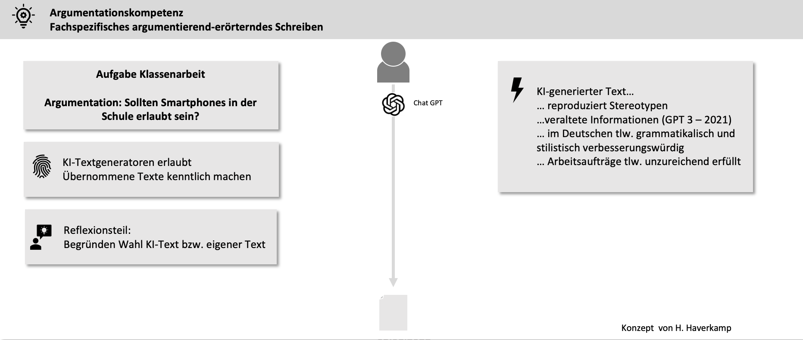

::: notes

Digitale Entwicklung im Bildungswesen 
Eigenständiges Erbringen von Leistungen: Hausaufgaben, Präsentationen und – besonders sensibel – von Prüfungsleistungen.

Ziel: zeitgemäße Prüfungsformate die an der Lebenswirklichkeit orientiert sind
KI im Unterricht praktisch erproben

KI-Klassenarbeit – Schüler können ihre Arbeit komplett oder tlw. mit KI-gestützen Textgeneratoren schreiben
 
Arbeitsaufträge z.T. unzureichend erfüllt: z.B. durch wirre Argumentation, fehlende Belege, Abweichen vom Thema, 

:::

## Reflektierter Umgang mit KI in der Schule  Deutschunterricht

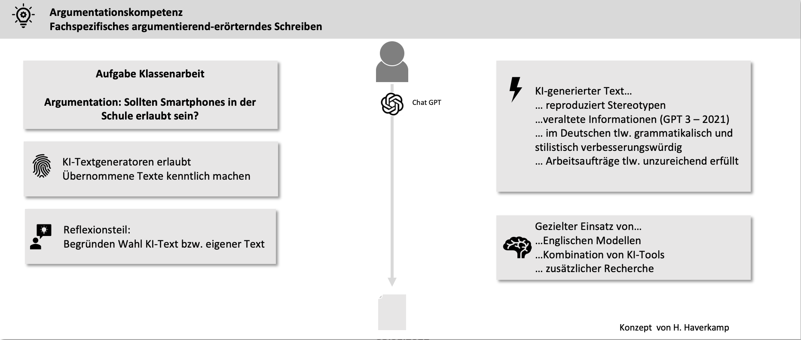

::: notes

Digitale Entwicklung im Bildungswesen 
Eigenständiges Erbringen von Leistungen: Hausaufgaben, Präsentationen und – besonders sensibel – von Prüfungsleistungen.

Ziel: zeitgemäße Prüfungsformate die an der Lebenswirklichkeit orientiert sind
KI im Unterricht praktisch erproben

KI-Klassenarbeit – Schüler können ihre Arbeit komplett oder tlw. mit KI-gestützen Textgeneratoren schreiben
 
Arbeitsaufträge z.T. unzureichend erfüllt: z.B. durch wirre Argumentation, fehlende Belege, Abweichen vom Thema, 

:::

## Reflektierter Umgang mit KI in der Schule  Deutschunterricht

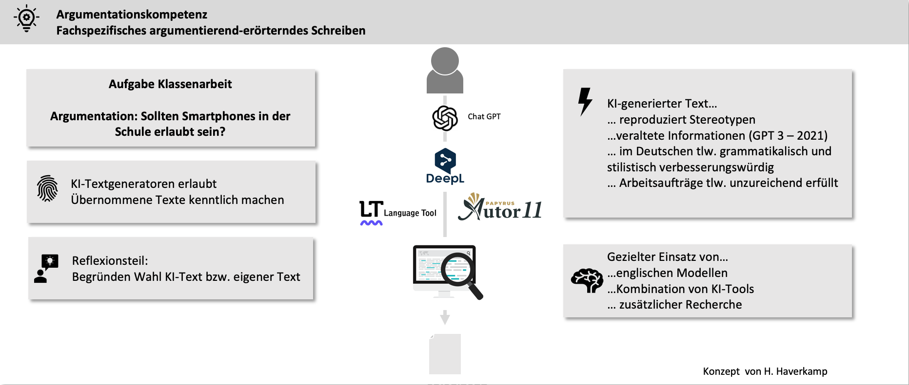

::: notes

Digitale Entwicklung im Bildungswesen 
Eigenständiges Erbringen von Leistungen: Hausaufgaben, Präsentationen und – besonders sensibel – von Prüfungsleistungen.

Ziel: zeitgemäße Prüfungsformate die an der Lebenswirklichkeit orientiert sind
KI im Unterricht praktisch erproben

KI-Klassenarbeit – Schüler können ihre Arbeit komplett oder tlw. mit KI-gestützen Textgeneratoren schreiben
 
Arbeitsaufträge z.T. unzureichend erfüllt: z.B. durch wirre Argumentation, fehlende Belege, Abweichen vom Thema, 

:::

## Beispiel: Politik

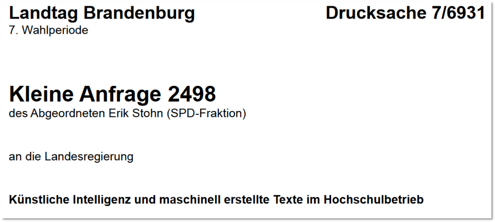
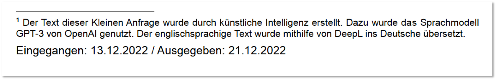

## Beispiel: Politik

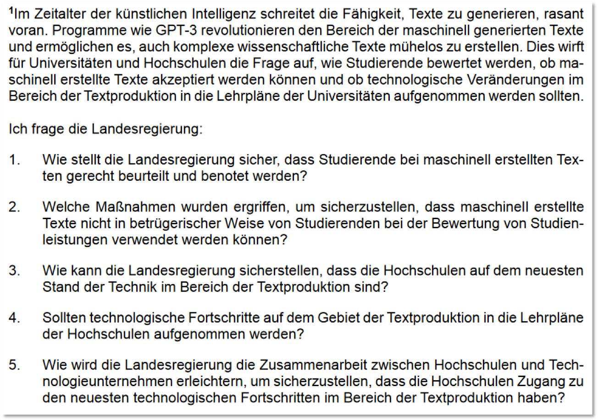

## Beispiel: Mathematik

<video width="1000" height="800" controls>
    <source src="../assets/video/example_ChatGPT-math.mp4" type="video/mp4"></source>
    
Your browser does not support the video tag. 

</video>

## Beispiel: Geschichte

::: columns
:::: column

>Write a summary in scientific style on the role of Top & Sons in Auschwitz, citing literature and sources.

>Topf & Sons was a German engineering firm that played a significant role in the Holocaust as a supplier of crematoria and incineration equipment to the Auschwitz concentration camp, where millions of Jews and other minorities were murdered. The company profited economically from the systematic extermination of Holocaust victims ...

<cite>ChatGPT</cite>

::::
:::: column

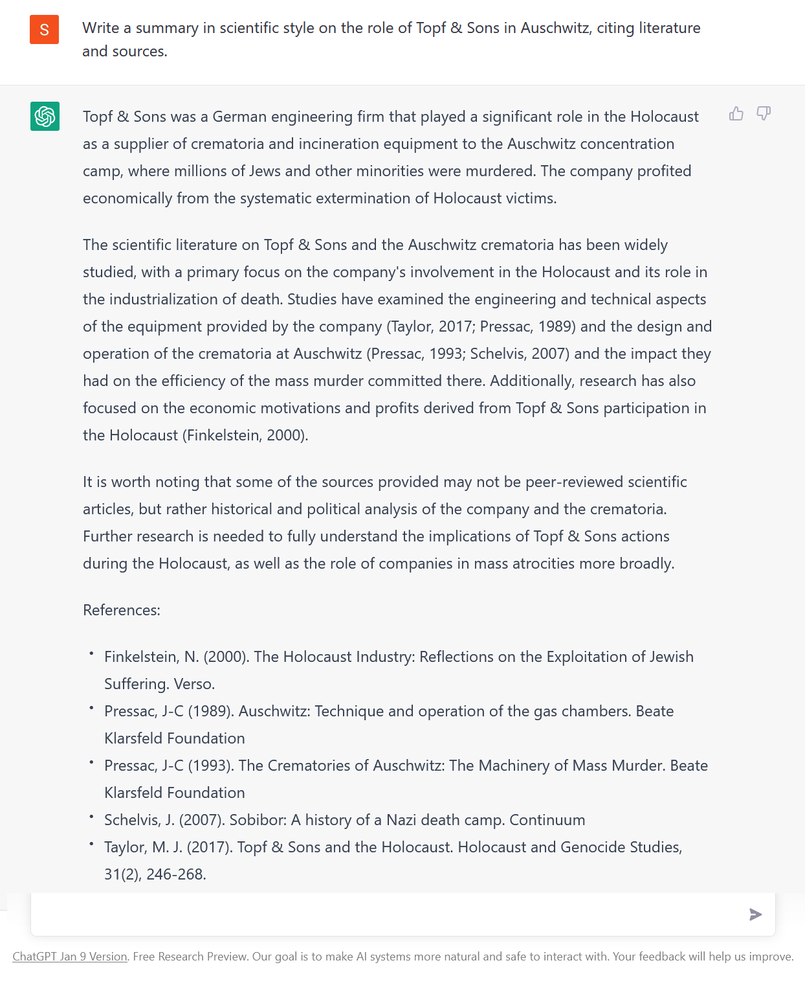{#fig:topf}

::::
:::

## Beispiel: Geschichte

::: columns
:::: column

- Formal: korrekt
- Inhaltlich: Fällt hinter Forschungsstand zurück

::::
:::: column

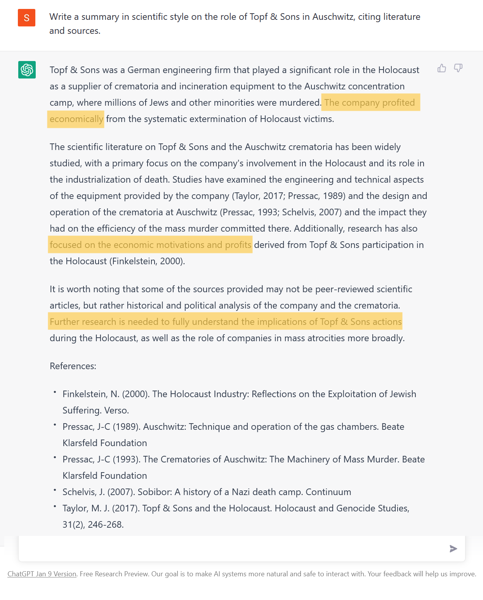{#fig:topf-1}

::::
:::

## Beispiel: Geschichte

::: columns
:::: column

- Formal: korrekt
- Inhaltlich: Fällt hinter Forschungsstand zurück

::::
:::: column

![[@Schuele2010IndustrieUndHolocaust]](../assets/images/ai/ts_cover_schule_industrie_und_holocaust.jpg)

::::
:::

## Beispiel: Geschichte

::: columns
:::: column

- Formal: korrekt
- Inhaltlich: Fällt hinter Forschungsstand zurück
- Literatur
    + Nicht wissenschaftlich, veraltet
    + Keine Relevanz für das Thema (Schelvis und Finkelstein)

::::
:::: column

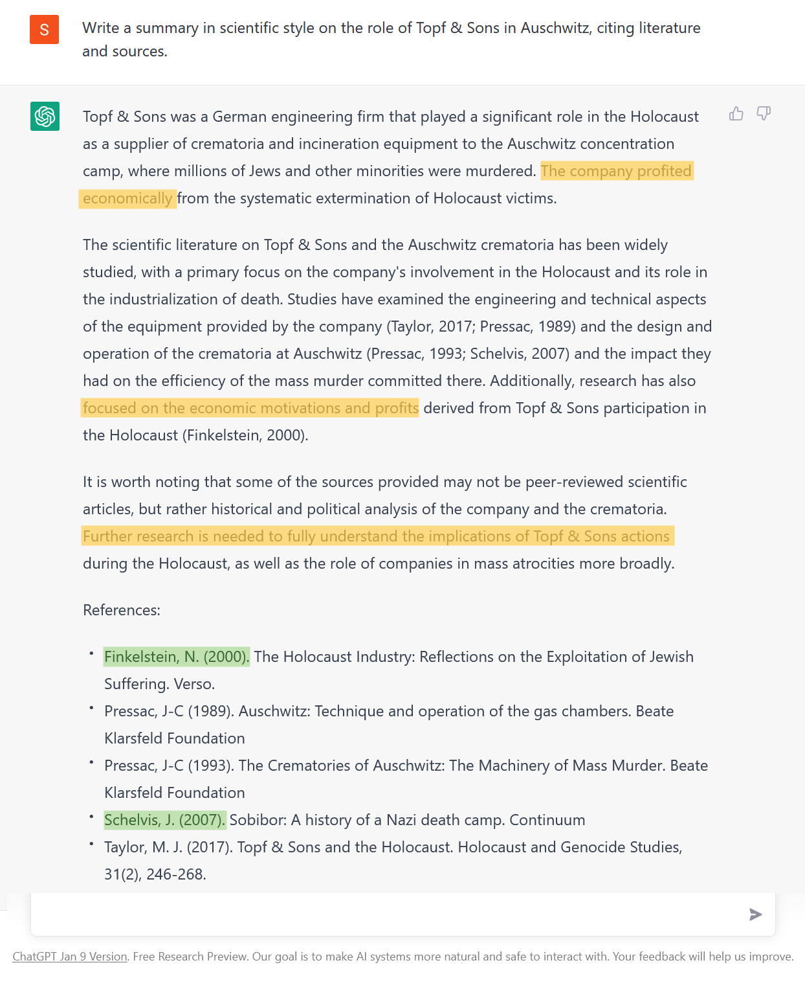{#fig:topf-2}

::::
:::

## Beispiel: Geschichte

::: columns
:::: column

- Formal: korrekt
- Inhaltlich: Fällt hinter Forschungsstand zurück
- Literatur
    + Nicht wissenschaftlich, veraltet
    + Keine Relevanz für das Thema (Schelvis und Finkelstein)
    + Fraglich/ problematisch (Pressac)

::::
:::: column

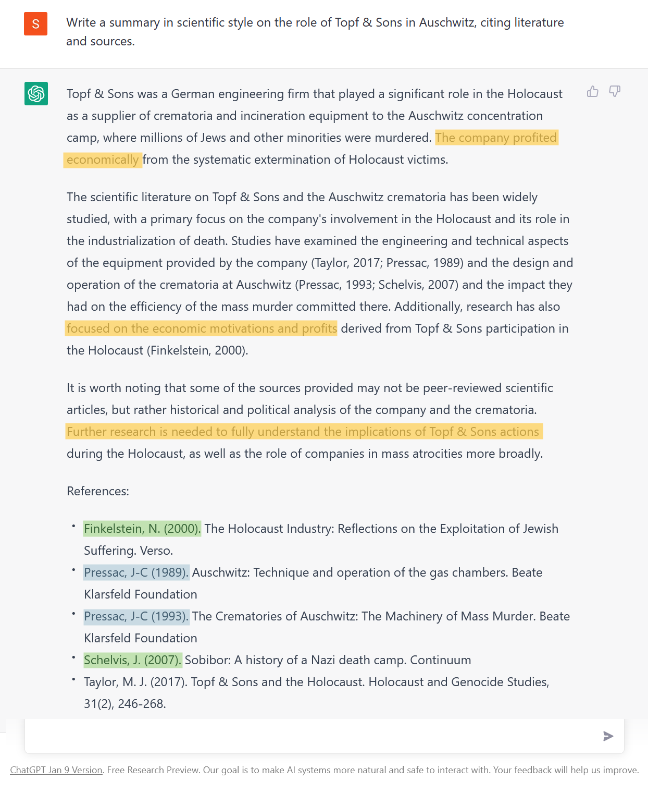{#fig:topf-3}

::::
:::

## Beispiel: Geschichte

::: columns
:::: column

- Formal: korrekt
- Inhaltlich: Fällt hinter Forschungsstand zurück
- Literatur
    + Nicht wissenschaftlich, veraltet
    + Keine Relevanz für das Thema (Schelvis und Finkelstein)
    + Fraglich/ problematisch (Pressac)
    + Nicht existent (Taylor 2017)

::::
:::: column

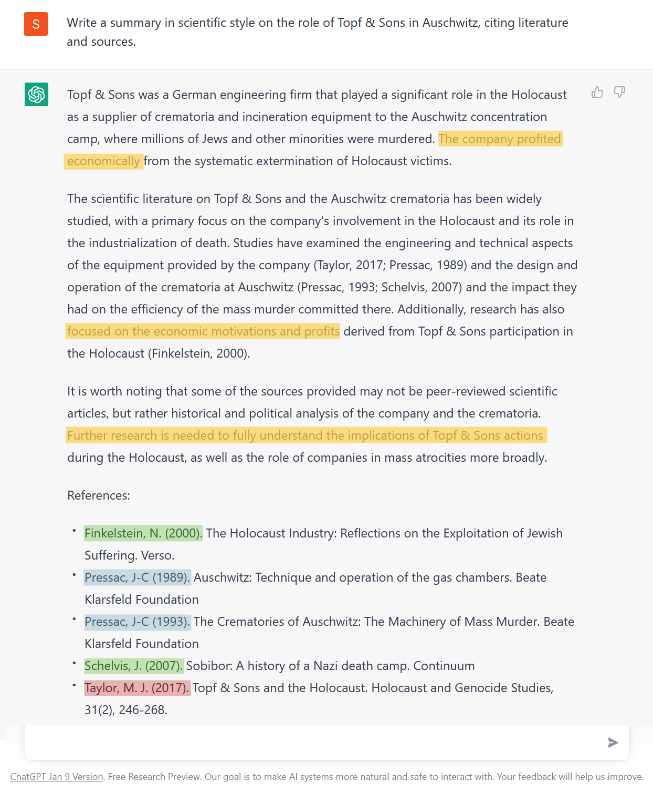{#fig:topf-4}

::::
:::

## Beispiel: Geschichte

::: columns
:::: column

- Formal: korrekt
- Inhaltlich: Fällt hinter Forschungsstand zurück
- Literatur
    + Nicht wissenschaftlich, veraltet
    + Keine Relevanz für das Thema (Schelvis und Finkelstein)
    + Fraglich/ problematisch (Pressac)
    + Nicht existent (Taylor 2017)

::::
:::: column

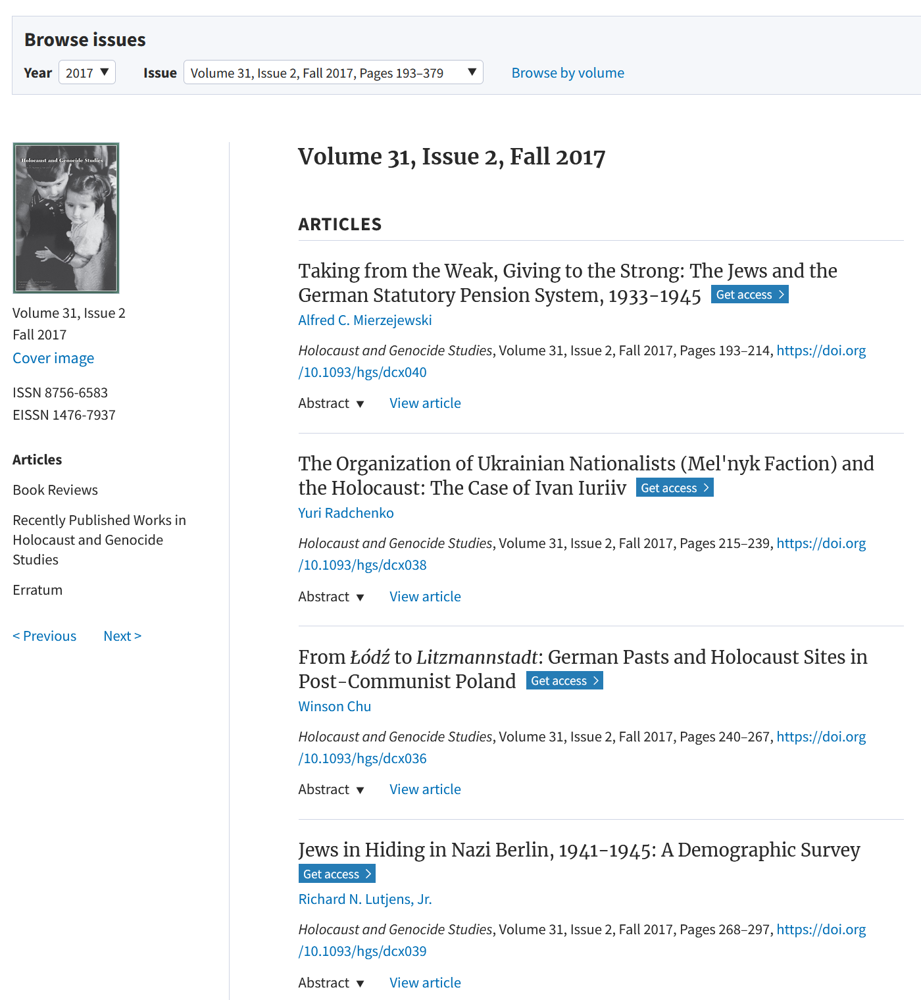{#fig:fake-lit}

::::
:::

## Beispiel: Geschichte

::: columns
:::: column

- Formal: korrekt
- Inhaltlich: Fällt hinter Forschungsstand zurück
- Literatur
    + Nicht wissenschaftlich, veraltet
    + Keine Relevanz für das Thema (Schelvis und Finkelstein)
    + Fraglich/ problematisch (Pressac)
    + Nicht existent (Taylor 2017)
- **Funktionsweise und Grenzen des Systems**
- **Überprüfbarkeit und Nachvollziehbarkeit der Inhalte**

::::
:::: column

{#fig:topf-5}

::::
:::

# Diskussion
## Wie nun damit umgehen?

::: columns
:::: column

### Allgemeine Probleme

- Transparenz der Angebote
- Monopole und Diversität der Anbietenden und der Methoden
- Gerechter Zugang zu den neuen Ressourcen
- Verantwortung für die inhaltlichen Grundlagen
- Datenhoheit und Privatsphäre

::::
:::: column

### Herausforderungen für die Lehre

- Verbieten oder einbinden?
- Welche konkreten Einsatzszenarien für Lehrende und Studierende gibt es?
- Welche konkreten Kompetenzen müssen für einen reflektierten Umgang mit diesen Tools vermittelt werden (und wie)?
- Müssen wir unsere Kompetenzmodelle und Prüfungsformate ändern und an die neuen Bedingungen anpassen, und wenn ja: wie?

::::
:::

## Diskussion und Austausch

# Schluß / Danke!
## Weiterführende Angebote

::: columns
:::: column

- Berliner Zentrum für Hochschullehre (<https://www.tu.berlin/bzhl>): KI in der Lehre

::::
:::: column

::::
:::

## Literatur {#refs}
