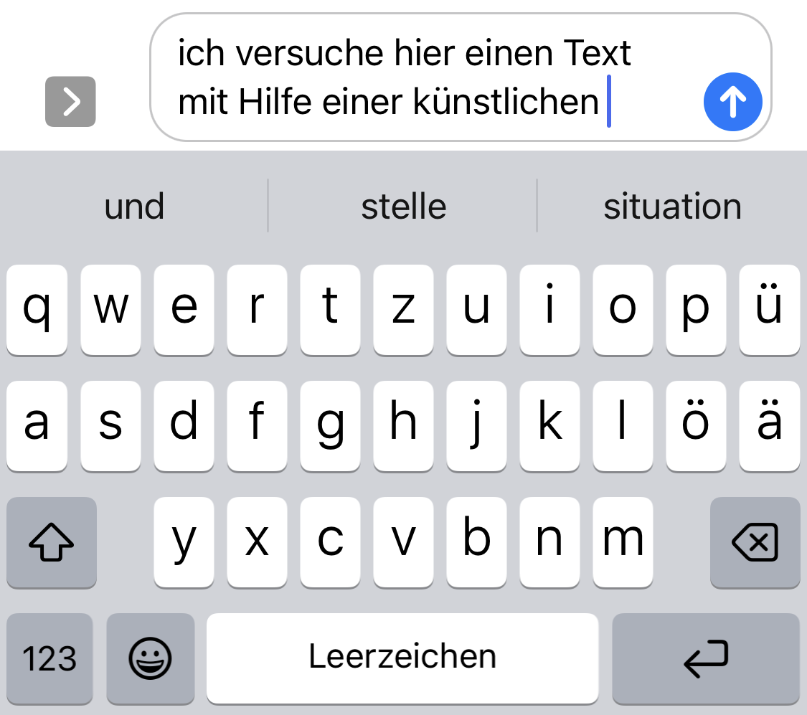

# KI?!
## Künstliche Intelligenz (KI / AI)

::: columns
:::: column

![Enthüllung einer Gedenktafel im Darthmouth College, Quelle: [@Belser2006AIConferenceReturns]](../assets/images/photos/ai-plaque-darthmouth-reveal.jpg){#fig:plaque}

::::
:::: column

- "Künstliche Intelligenz" ist ein **altes** Buzzword, das sich findige Wissenschaftler 1956 für einen Förderantrag ausgedacht haben.
- Es ist besser von **maschinellem Lernen** (ML) und **künstlichen neuronalen Netzen** zu sprechen.

::::
:::

::: notes

- Dartmouth Conference im Sommer 1956 
- sechswöchiger Workshop mit dem Titel Dartmouth Summer Research Project on Artificial Intelligence
- von der Rockefeller Foundation gefördert
- "In 1955, John McCarthy, then a young Assistant Professor of Mathematics at Dartmouth College, decided to organize a group to clarify and develop ideas about thinking machines." <https://en.wikipedia.org/wiki/Dartmouth_workshop>

:::

## Maschinelles Lernen (ML)

<!-- <pre class="mermaid">
---
title: Blackbox KI
---

flowchart LR
    Input --&gt; bb[["Künstliche Intelligenz"]] --&gt; Output
</pre> -->

::: columns
:::: column

### Was?

- Algorithmen, die auf der Basis sehr großer Datensätze statistische Modelle anlegen (trainieren)
- Es gibt verschiedenste Arten des ML
    - Supervised
    - unsupervised
    - transfer learning
    - deep learning
    - reinforcement learning

::::
:::: column

### Wie?

::::
:::

::: notes

- ist nicht neu

:::

## Large Language Models (LLMs)

::: columns
:::: column

### Was?

- Modelle: Mapping, Reduction, Purpose [@Stachowiak1973AllgemeineModelltheorie]
- Sprach-Modelle: Wahrscheinlichkeitsverteilung von Tokens in einer Sequenz innerhalb eines Korpus
    + Modelle werden auf Basis eines Korpus von Texten *trainiert*
    + stochastische Papageien [@BenderEtal2021StochasticParrots]
- Groß: 
    + Hunderte Milliarden von Parametern
    + Benötigen hunderte GB Speicherplatz

::::
:::: column

### Beispiel

{#fig:ios-keyboard}

::::
:::

::: notes

- Modelle haben drei grundlegende Eigenschaften [@JannidisFlanders2019GentleIntroduction, 28; @Stachowiak1973AllgemeineModelltheorie]
    1. **Mapping**: Ein Model ist ein Model von etwas
    2. **Reduction**: Ein Model ist nicht das Original sondern bildet für die Untersuchenden wichtige Aspekte ab
    3. **Purpose**: Ein Model hat einen Zweck: es soll von jemanden für etwas benutzt werden
+ "stochastic parrots" [@BenderEtal2021StochasticParrots, 617]
    * Wer trifft die Auswahl?  
    * Welche sozio-kulturellen Biases perpetuieren sich hier?
- Beispiele
    - [BERT](https://github.com/google-research/bert): Bidirectional Encoder Representations from Transformers  --> Google
    - LaMDA: Language Models for Dialog Applications --> Google
    - GPT: Generative Pre-trained Transformer --> [OpenAI](https://openai.com/) <-- Microsoft
    - DALL-E --> [OpenAI](https://openai.com/) <-- Microsoft
:::

## Transformer Modelle

<!--  -->

## Transformer Modelle

::: columns
:::: column

- Anwendung: z.B. Natural Language Processing (NLP)
- Prinzip:
    + Die Inputsequenz wird in Tokens (Worte) zerschnitten
    + Tokens werden in Vektoren übersetzt (Word embedding), bei dem Informationen über die Position des Tokens in der Inputsequenz erfasst wird. 
- Beispiele: 
    - `Königin - weiblich = König`
    - `Arzt + weiblich = Krankenschwester`

::::
:::: column

<pre class="mermaid">
flowchart LR
    comp1((Google)) --> bert[(BERT: Bidirectional \nEncoder Representations \nfrom Transformers)]
    comp1 --> lambda[(LaMDA: Language Models \nfor Dialog Applications)]
</pre>
<pre class="mermaid">
flowchart LR
    comp2((OpenAI)) --> dalle[(DALL-E)]
    comp2 --> gpt[(GPT: Generative \nPre-trained Transformer)]
</pre>

::::
:::

::: columns-3
:::: column

- [ChatGPT](https://chat.openai.com/)
- [Rytr](https://rytr.me/)
- [You](https://you.com/search?q=how+to+write+well)

::::
:::: column

- [Moonbeam](https://www.gomoonbeam.com/ )
- [Elicit](https://elicit.org/)
- [Lex](https://lex.page/)

::::
:::: column

- [R Tutor](http://rtutor.ai) <!-- : Zum Erlernen von R-->
- [GitHub CoPilot]()
- [OpenAI detector](https://huggingface.co/openai-detector)

::::
:::

# ChatGPT
## ChatGPT

::: columns
:::: column

- Ein "Chatbot" auf der Basis von GPT-3
- Entwickelt von OpenAI
- Veröffentlicht am 30 November 2022

::::
:::: column

<pre class="mermaid">
flowchart BT
    comp2((OpenAI\n2015)) --> gpt[(GPT: Generative\nPre-trained\nTransformer\n2018)]
    gpt --> gpt3[(GPT-3\n2020)]
    gpt3 --> dalle{DALL-E\n2021}
    gpt3 ---> chatgpt{ChatGPT\n2022}
    pers1[Elon Musk] -.-> |co-funded| comp2
    pers2[Peter Thiel] -.-> |co-funded| comp2
    comp4(("Amazon Web\nServices (AWS)")) -.-> |co-funded| comp2
    comp3((Microsoft)) -.-> |invested| comp2
</pre>

::::
:::

# Schluß / Danke!
## Literatur {#refs}
