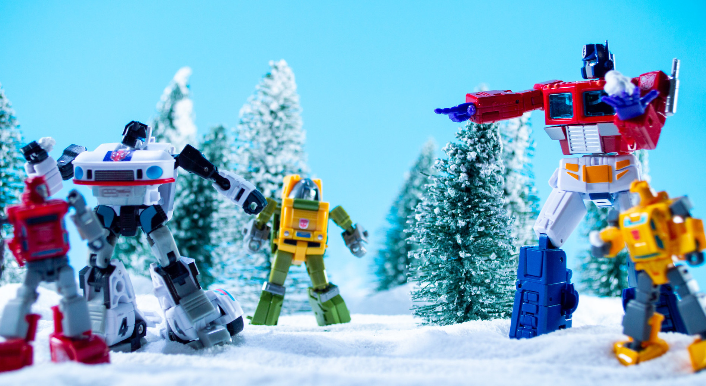

## Was ist ChatGPT?

::: columns
:::: column

>ChatGPT ist der Prototyp eines Chatbots, [...] der auf **künstlicher Intelligenz** (KI) beruht. Er wurde von dem US-amerikanischen Unternehmen OpenAI entwickelt und im November 2022 veröffentlicht. Um [...] das dahinter stehende **Modell** zu verbessern, wird die KI von ChatGPT fortlaufend durch menschliches Feedback **trainiert**.
<cite>[Wikipedia](https://de.wikipedia.org/wiki/ChatGPT)</cite>

::::
:::: column

<pre class="mermaid">
flowchart RL
    comp2((OpenAI\n2015)) --> gpt[(GPT: Generative\nPre-trained\nTransformer\n2018)]

    gpt --> chatgpt{ChatGPT\n2022}

    click chatgpt "https://chat.openai.com/" _blank
</pre>

::::
:::

# KI?  Was soll das sein?!
## Künstliche Intelligenz (KI / AI)

::: columns
:::: column

![Enthüllung einer Gedenktafel im Darthmouth College, Quelle: [@Belser2006AIConferenceReturns]](../assets/images/ai/ai-plaque-darthmouth-reveal.jpg){#fig:plaque}

::::
:::: column

- "Künstliche Intelligenz" ist ein **altes** Buzzword, das sich findige Wissenschaftler 1956 für einen Förderantrag ausgedacht haben.
- Es ist besser von **maschinellem Lernen** (ML) und **künstlichen neuronalen Netzen** zu sprechen.

::::
:::

::: notes

- Dartmouth Conference im Sommer 1956 
- sechswöchiger Workshop mit dem Titel Dartmouth Summer Research Project on Artificial Intelligence
- von der Rockefeller Foundation gefördert
- "In 1955, John McCarthy, then a young Assistant Professor of Mathematics at Dartmouth College, decided to organize a group to clarify and develop ideas about thinking machines." <https://en.wikipedia.org/wiki/Dartmouth_workshop>

:::

## Maschinelles Lernen (ML)

<!-- <pre class="mermaid">
---
title: Blackbox KI
---

flowchart LR
    Input --&gt; bb[["Künstliche Intelligenz"]] --&gt; Output
</pre> -->

::: columns
:::: column

### Was?

- Algorithmen, die auf der Basis sehr großer Datensätze statistische Modelle anlegen (trainieren)
- Es gibt verschiedenste Arten des ML
    - Supervised
    - unsupervised
    - transfer learning
    - deep learning
    - reinforcement learning

::::
:::: column

### Wie?

::::
:::

::: notes

- ist nicht neu

:::

## Large Language Models (LLMs)

::: columns
:::: wide

### Was?

- **Modelle** [@Stachowiak1973AllgemeineModelltheorie]: 
    + Abbildung
    + Verkürzung/Reduktion
    + Zweckbindung 
- **Sprach**Modelle: statistische Wahrscheinlichkeitsverteilung von Tokens in einer Sequenz innerhalb eines Korpus
    + werden auf Basis eines Korpus von Texten *trainiert*
    + sind "stochastische Papageien" [@BenderEtal2021StochasticParrots]
- **Große** Sprachmodelle: 
    + Hunderte Milliarden von Parametern
    + Benötigen hunderte GB Speicherplatz

::::
:::: narrow

### Beispiel

{#fig:ios-keyboard}

::::
:::

::: notes

- Modelle haben drei grundlegende Eigenschaften [@JannidisFlanders2019GentleIntroduction, 28; @Stachowiak1973AllgemeineModelltheorie]
    1. **Mapping**: Ein Model ist ein Model von etwas
    2. **Reduction**: Ein Model ist nicht das Original sondern bildet für die Untersuchenden wichtige Aspekte ab
    3. **Purpose**: Ein Model hat einen Zweck: es soll von jemanden für etwas benutzt werden
+ "stochastic parrots" [@BenderEtal2021StochasticParrots, 617]
    * Wer trifft die Auswahl?  
    * Welche sozio-kulturellen Biases perpetuieren sich hier?
- Beispiel GPT-3 (Generative Pre-trained Transformer)
    + 2048-token-long context and 175 billion parameters (requiring 800 GB of storage).
:::

## Transformer Modelle

<!--  -->

{#fig:transformer-models}

## Transformer Modelle (2017)

::: columns
:::: column

- Sind Anwendungen von deep learning, die vor allem für Natural Language Processing (NLP) entwickelt wurden
- Prinzip:
    + Die Inputsequenz wird in Tokens (Wörter, Sätze etc.) zerschnitten
    + Tokens werden in Vektoren *übersetzt* (Word embedding), bei dem Informationen über die Position des Tokens in der Inputsequenz erfasst wird. 
- Beispiele: 
    - `Königin - weiblich = König`
    - `Arzt + weiblich = Krankenschwester`

::::
:::: column

<pre class="mermaid">
flowchart LR
    comp1((Google)) --> bert[(BERT: Bidirectional \nEncoder Representations \nfrom Transformers)]
    comp1 --> lambda[(LaMDA: Language Models \nfor Dialog Applications)]
    click bert "https://github.com/google-research/bert" _blank
</pre>
<pre class="mermaid">
flowchart LR
    comp2((OpenAI)) --> gpt[(GPT: Generative \nPre-trained Transformer)]
</pre>

::::
:::

::: columns-3
:::: column

- [ChatGPT](https://chat.openai.com/)
- [Rytr](https://rytr.me/)
- [You](https://you.com/search?q=how+to+write+well)

::::
:::: column

- [Moonbeam](https://www.gomoonbeam.com/ )
- [Elicit](https://elicit.org/)
- [Lex](https://lex.page/)

::::
:::: column

- [R Tutor](http://rtutor.ai) <!-- : Zum Erlernen von R-->
- [GitHub CoPilot]()
- [OpenAI detector](https://huggingface.co/openai-detector)

::::
:::

::: notes

>Ein Transformer besteht im Wesentlichen aus in Serie geschalteten Kodierern (Encoder) und in Serie geschalteten Dekodierern (Decoder).[2][3][4] Die Eingabesequenz wird durch eine sogenannte Embedding-Schicht in eine Vektorrepräsentation überführt. Die Gewichte der Embedding-Schicht werden während des Trainings angepasst. Im Falle des Transformers kommt zusätzlich eine Positionskodierung zum Einsatz, wodurch die sequentielle Abfolge der Wörter berücksichtigt werden kann. Ein Wort erhält somit zu Beginn eines Satzes eine andere Repräsentation als am Ende.[3]

>Die Eingabesequenz wird in der Vektorrepräsentation einer Serie von Kodierern übergeben und in eine interne Repräsentation überführt. Diese interne Repräsentation bildet die Bedeutung der Eingabesequenz abstrakt ab[4] und wird durch die Dekodierer in eine Ausgabesequenz übersetzt.[4] Die Eingabesequenz wird hierbei in Batches verarbeitet, wobei die Länge der Kodierer-Dekodierer-Pipeline die maximale Länge der Eingabesequenz beschränkt.[3] Je nach Größe des Netzwerks können beispielsweise einzelne Sätze oder auch ganze Absätze verarbeitet werden. Bei Eingabesequenzen, welche kürzer sind als die Länge der Kodierer-Dekodierer-Pipeline, wird Padding genutzt, um die Eingabesequenz aufzufüllen.[3]

:::

# ChatGPT
## ChatGPT

::: columns
:::: column

- Ein "Chatbot" auf der Basis von GPT-3
+ Entwickelt von OpenAI

::::
:::: column

+ Veröffentlicht am 30 November 2022
- unterstützt alle im Internet dominant vertretenen Sprachen

::::
:::

<pre class="mermaid">
flowchart RL
    comp2((OpenAI\n2015\nnonprofit)) ==> gpt[(GPT: Generative\nPre-trained\nTransformer\n2018)]
    pers1[Elon Musk] -.-> |co-funded| comp2
    pers2[Peter Thiel] -.-> |co-funded| comp2
    comp4(("Amazon Web\nServices (AWS)")) -.-> |co-funded| comp2

    gpt ==> comp5((OpenAI\n2019\nfor profit))
    comp5 ==> gpt3[(GPT-3\n2020)]
    comp3((Microsoft)) -.-> |invested| comp5
    comp3 <-..- |exclusive use| gpt3

    gpt3 --> dalle{DALL-E\n2021}
    gpt3 ===> chatgpt{ChatGPT\n2022}
    comp4 --> |hosts| data1[("Common Crawl\ndata set\n2011-")]
    data1 --> |training\nset for| gpt

    comp6((Common Crawl\nnonprofit)) --> |provides| data1

    click chatgpt "https://chat.openai.com/" _blank
    click dalle "https://openai.com/blog/dall-e/" _blank
    click comp6 "http://commoncrawl.org/" _blank
</pre>

## Wer kann das benutzen?

Die Nutzung ist zunächst kostenfrei nach Anmeldung und in der Kapazität begrenzt

::: columns
:::: column

{#fig:chatgpt-max}

::::
:::: column

{#fig:chatgpt-cost}

::::
:::

# Schluß / Danke!
## Literatur {#refs}
