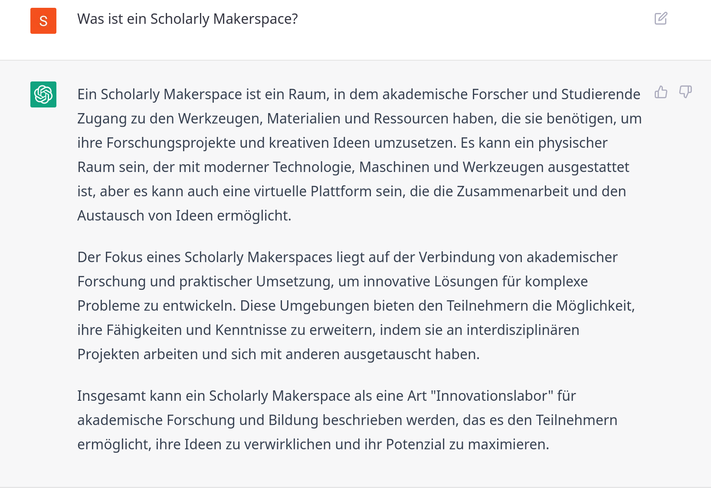

## Hi

Wir bauen im Rahmen des DFG-Projekts "Future e-Research Support in the Humanities" an der Universitätsbibliothek der Humboldt-Universität zu Berlin unter Beteiligung der Lehrstühle für *Digital History* (Inst.f. Geschichtswissenschaften) und *Information Processing and Analytics* (Inst.f. Bibliotheks- und Informationswissenschaften) einen **prototypischen *Scholarly Makerspace*** zur Förderung von **Werkzeugkompetenz** (*tool literacy*) in den Geistes- und Kulturwissenschaften auf (2022--25).

::: columns-3
:::: column

::::
:::: column

::::
:::: column

::::
:::

::: notes

- Sophie
    + Museologie, Medieninformatik sowie Digital History (MA)
    + Doktorandin und Wimi am Lehrstuhl Digital History
    + Schwerpunkt auf Research Software Engineering
- Till
    + Geschichte (PhD, MA)
    + Islamwissenschaft, Judaistik und VWL
    + mehr als 10 Jahre Erfahrungen in den DH
        * Global DH, critical DH: unter den Bedingungen des Globalen Südens
        * multilingual DH: vor allem Arabisch und Osmanisch
        * Digitale Editorik, NER
        * Netzwerkanalyse, Stilometrie
        * Data viz
- Sam
    + Bibliotheks- und Informationsmanagement
    + Information Science
    + Außerdem am FID Buch-, Bibliothek-, und Informationswissenschaft angestellt
    + Schwerpunkt
        * User Experience

:::

# Scholarly Makerspace

## Makerspace

>Im Wesentlichen geht es bei der Makerbewegung um das Teilen von **Räumen**, **Ressourcen** und **Wissen** innerhalb einer **Gemeinschaft**. Diese Ressourcen stehen Einzelpersonen privat oft nicht zur Verfügung. Die Ermöglichung des Zugangs für alle, stellt so einen zentralen Faktor für eine offene und demokratische Gesellschaft dar. [@Heinzeletal2020Einleitung, 2]

::: notes

Makerspace als Ort für
    - Lernen
    - Forschen
    - Co-Produktion

:::

## Computergestützte Methoden in der Praxis

Fokus auf computergestützte Methoden in den Geistes- und Kulturwissenschaften

::: columns
:::: column

1. An Forschungsfragen orientiert

::::
:::: column

{#fig:wordcloud}

::::
:::

<!-- {#fig:network-analysis} -->

<!--  -->

:::notes

+ Wie lassen sich (sehr) große Corpora mit *distant reading* statistisch valide erschließen?
    * konkretes Beispiel: 
        - was sind die wichtigsten Werkzeuge in den DH?
            + DH: abgebildet durch Konferenzen, Journals, Anträge etc.
            + wichtig: am häufigsten
        - wer sind die wichtigsten Autor:innen innerhalb einer von Periodika abgebildeten Öffentlichkeit?
+ Wie lassen sich Soziale Medien für die Untersuchung gesellschaftlichen Wandels in repressiven Systemen nutzen?

:::

## Werkzeug- und Methodenkritik

Fokus auf computergestützte Methoden in den Geistes- und Kulturwissenschaften

2. Konsequenzen für Forschungsprozesse und Erkenntnis 

](https://furesh.github.io/slides/assets/images/ocr_deutsches-zeitungsportal.png){#fig:ocr}

:::notes

+ Welche Auswirkungen haben OCR Algorithmen und Normalisierung auf die Qualität meines Korpus?
+ Was ist die Auswirkung von abstrahierenden Operationalisierungen für die quantitative Auswertung?
+ Welche Folge hat es, wenn Quellen nur noch gezielt und dekontextualisiert über Schlagworte gesucht werden können, aber kein Stöbern mehr möglich ist?

:::

## Geistes- und kulturwissenschaftliche Reflexion 

Fokus auf computergestützte Methoden in den Geistes- und Kulturwissenschaften

3. Techno-soziale Auswirkungen und gesellschaftliche Rahmenbedingungen 

::: columns
:::: column

{#fig:transformer-model}

::::
:::: column

{#fig:chatgpt}

::::
:::

::: notes

- Die Folie zeigt zwei Transformermodelle
+ Wie hoch ist der Verbrauch natürlicher Ressourcen für das Training einer KI auf die Klassifizierung von Abbildungen in mittelalterlichen Handschriften?
+ Was ist mit dem Einsatz von Sklaverei-ähnlichen Zuständen für die Herstellung und Erhalt der notwendigen technischen Infrastrukturen?
+ Welche Folge hat eine auf Beiträge in den Sozialmedien trainierte KI für die Hausratversicherungen in sozialen Brennpunkten?

:::

## Werkzeugkompetenz (tool literacy) 

>It is our position that the "digital" cannot be understood as a separate domain of culture. If we actually examine the digital [...] we see that today digital information processing is present in every aspect of our lives [@CPCAbout].

>Do artefacts have politics? [@Winner+1980]

::: notes

- Folie soll erklären warum digitale Werkzeugkompetenz nötig ist
- Alle Aspekte des Forschungsprozesse sind bereits digital remediiert und duch informationstechnische Systeme angefasst worden
    1. Erstellung, Aufbereitung **digitaler Materialien**
    2. **computationelle Be- / Verarbeitung** dieser Materialien
    3. **Präsentation** der Ergebnisse, der Prozesse und der Materialien

- Es herrscht in der Breite ein Mangel an 
    + **Theorie**: Verständnis des epistemischen Wandels
    + **Methode**: Beherrschung der notwendigen Werkzeuge
    + positivem **Wissen**: Überblick über die Möglichkeiten
- *"Digital" Humanities* als Indikator

:::

## Werkzeug

<!-- - Software, mit der bestimmte Verfahren praktisch umgesetzt werden und die in der geistes- und kulturwissenschaftlichen Forschung zum Einsatz kommen (z.B. 3D-Modelling, Topic Modelling, Stilometrie, Netzwerkanalyse, Digital Publishing)
- Die Verfahren beziehen sich auf alle Verfahren im Forschungsprozess, also von Datenbeschaffung und -aufbereitung über die Analyse und Interpretation bis hin zur Präsentation und Veröffentlichung
- Beispiel für solche Software kann sein:
    - Open Refine
    - Gephi
    - Voyant Tools
    - Passim
    - Wordpress
    - etc. -->

::: columns
:::: column

**Software**

+ setzt **Verfahren** praktisch um
+ benötigt Hardware, weitere Software
+ interagiert mit **Formaten**
+ Bsp.: Gephi, VoyantTools

::::
:::: column

**Verfahren** 

- sind Teil von Methoden in der Forschungspraxis
+ Bsp.: 3D-Modelling, Topic Modelling, Stilometrie, Netzwerkanalyse, Digital Publishing ...

::::
:::

## Machen

<!-- >Do politics have artefacts? [@DunbarHester2014LowPower] -->

>To use [...] tools well, we must, in some real sense, understand them better than the tool makers. [...] The best kind of tools are therefore the ones that we make ourselves. [@Tenen2016BluntInstrumentalism, 85]

**Machen** 
    als Experimentieren, Tüfteln, Ausprobieren
    als ergebnisorientierte Umsetzung

::: {.blackbox .columns-3}
:::: {.input #bb_div_input}

<!-- ### Input -->

<textarea class="form-control to_clear" type="text" placeholder="Geben Sie einen Text ein" id="bb_input"></textarea>
<!-- <button type="button" id="bb_button_create_input">Generiere Input</button> -->

::::
:::: {.hidden .output #bb_div_output}

<!-- ### Output -->

<!-- 

 -->

::::
:::: {.computing #bb_div_blackbox}

<!-- ### Blackbox -->

<button class="button-49" type="button" id="bb_button_compute">???</button>
<button type="button" class="button-49 hidden" id="bb_button_input">Zeige den Inhalt</button>
<button type="button" class="button-49 hidden" id="bb_button_clear">Leeren</button>

::::

:::: {.hidden .content #bb_div_content}

::::
:::

<!-- the script powering the blackbox -->

::: notes

- Grundsatz: Werkzeuge und Methoden sind mit Machtverhältnissen verwoben
- Tool literacy ist extrem aufwändig
    + kann **nur kollaborativ** adäquat bewältigt werden. 
- Geschichte
    + 1970er Kalifornien: kooperative Werkstätten
    + Recht auf Reparatur
    + DIY: do it yourself culture
    + "Maker Movement Manifesto" von Hatch (2013)
        * make, share, give, learn, tool up, play, participate, support, change
- bezieht sich auf [@Wythoff2022MinimalComputing], der die beiden Fragen verknüpft hat
    + Do artefacts have politics? [@Winner+1980]
    + Do politics have artefacts? [@DunbarHester2014LowPower]
- Kritik an Maker culture als omnipotenter maskuliner Raum:
    - >knowledge of circuitry is often conflated with (superheroic) command over people, situations, and things. In present-day “maker” cultures, consider the ubiquity of remarks such as “getting under the hood” or “knowing the nuts and bolts,” which tend to fuse logic with mastery, control with masculinity, engineering with rationality, and programming with revealing. [@Sayers2017Introduction, 3]

:::

# Wie sieht das konkret aus?
## Lern- und Arbeitsort

Der *Scholarly Makerspace* ist montags, mittwochs und donnerstags von 10 bis 14 Uhr geöffnet.

- Platz für 12 Personen
- 6 Monitore
- 3 Rechner
- Whiteboard
- Flipchart, Moderationsmaterial
- Loslegen

::: columns
:::: column

::::
:::: column

::::
:::

## Beratung und Unterstützung

::: columns
:::: column

### Infrastruktur und Ressourcen

+ Raum für Arbeitsgruppen und Projekte
+ Virtuelle Lern- und Arbeitsumgebung
+ Cloudserver
<!-- + Zugang zu technischen Infrastrukturen der HU (z.B. CMS) -->

::::
:::: column

### Persönlicher Kontakt

+ regelmäßige Kontaktzeiten
+ gezielte Beratung 
+ Veranstaltungen

::::
:::: column

### Vernetzung

in die DH Community in Berlin und beyond

+ Community hours für den Austausch
+ [Veranstaltungskalender](https://makerspace.hypotheses.org/324)

::::
:::

::: notes

- bestehende Vernetzungen
    + Hackathon zur Archivierung von Ukrainischem Kulturgut 
        * in den Räumen des IfG
    + SPK Lab Partner
    + Stiftung für die deutsche Wissenschaft (in der Folge des Hackathons)
    + ADA Lovelace Center
        * gemeinsamer jour fixe
        * Veranstaltung zu Kulturen des Scheiterns
    - SUB Hamburg, Symposium "Wissen Bauen 2025"

- wichtig für den gemeinschaftlichen Ansatz ist es, diesen nicht hierarchisch zu denken
    + wir das Personal sind nicht die Experten, die frontal erklären
- >To say, “I can do first aid,” is to underscore our entanglement with circuitry. And to say, “I don’t know all the circuitry,” at least implies the impossibility of such knowledge. That is, we can reject the autonomy or privacy of technologies without supposing we know them completely. Although we may understand how something works, we may not apprehend how or under what conditions it was made. [@Sayers2017Introduction, 2]
- >knowledge of circuitry is often conflated with (superheroic) command over people, situations, and things. In present-day “maker” cultures, consider the ubiquity of remarks such as “getting under the hood” or “knowing the nuts and bolts,” which tend to fuse logic with mastery, control with masculinity, engineering with rationality, and programming with revealing. [@Sayers2017Introduction, 3]

:::

## Ressourcen

::: columns
:::: column

### Werkzeuge

- Modularisierte Werkzeuge, Werkzeugkisten und -regale
- Verweise auf Literatur, Tutorials, Use cases

::::
:::: column

### Infrastruktur

- Raum (Monitor, Internetzugang, Arbeitsmaterial) 
- Server in der HU-Cloud
- Vermittlung und Beratung zu HU-Diensten

<!--  -->

::::
:::

::: notes

Hinsichtlich der Ressourcen denken wir den Makerspace zweiteilig:

1. zum einen wollen wir Infrastrukturen vor Ort zur Verfügung stellen (Hardware, mit der gearbeitet werden kann, aktuell Dockingstations, kann durchaus erweitert werden z.B. 3D-Drucker, wenn Bedarf da ist), aber auch vorhandene Infrastrukturangebote an der HU nutzbar machen (Zugang zu GPU-Rechenkapazitäten, Server des CMS, etc.)
2. zum anderen aggregieren wir bei uns digitale Werkzeuge, welche im geisteswissenschaftlichen Forschungsprozess zum Einsatz kommen
    * wobei wir Werkzeuge metaphorisch als physisch denken und diese entsprechend nach Werkzeugkisten  und -regale systematisieren
    * daneben gibt es Werkzeuganleitungen, die aus Literatur, Tutorials und Best Practices bestehen

:::

## Zielgruppen 

Forscher_innen aller Karrierestufen ab der Promotionsphase

::: columns-3
:::: column

### Typ 1

Erstes Interesse an Digital Humanities

::::
:::: column

### Typ 2

Forschungsfrage und -plan, Schwierigkeiten bei der Umsetzung

::::
:::: column

### Typ 3

Forschungsfrage und Kompetenz, mangelnder Zugang zu Infrastrukturen

::::
:::

::: notes

- Das konkrete Angebot differenziert sich nach Typen von Nutzer_innen
- nicht auf Typologie eingehen

:::

## Beratung unterstützen: Tool Registry

Erstellung einer offenen, Wikidata-basierten Tool Registry im Rahmen des Aufbaus eines **prototypischen** Scholarly Makerspace.

::: columns
:::: column

### Ziel und Zweck

- Beschreiben und Verzeichnen mit Basisdatenmodell und bestehenden Vokabularen wie [TaDiRAH](https://vocabs.dariah.eu/tadirah)
- Suchen und Finden 
- Aufbau einer Sammlung

::::
:::: column

### Nachhaltige Infrastruktur

- Nutzung vorhandener Informationen (linked open data)
- Beitrag zu *digital commons*
- Prototypische Konzeption und Umsetzung einer offenen Infrastruktur 

::::
:::

## Was ist daran neu?

::: columns
:::: column

### Bisher

Tool registries sind Legion: 

- DiRT -> Bamboo -> [TAPoR (3.0)](https://tapor.ca/) [@GrantEtAl2020AbsorbingDiRT]
- *Social Sciences and Humanities Open Marketplace*](https://marketplace.sshopencloud.eu)

Problem: "DiRT trap" [@Dombrowski2021DirectoryParadox]

- Geschlossene Systeme
- Anspruch auf Vollständigkeit
- Begrenzte Finanzierung

::::
:::: column

### Unser Ansatz

- **Open Data**
    - Bereitstellung (Zugang), 
    - Bearbeitung, 
    - Nachnutzung sowie Interoperabilität
- Modulare Infrastruktur
    + Basisdatenmodell 
    + Wikidata 
    + Wikiproject
    + Webanwendung

::::
:::

## Basisdatenmodell

{#fig:data-model}

Anspruch eines allgemeingültigen minimalen Datenmodells erfordert ein iteratives Vorgehen mit Datenmodellanpassungen

## <!-- -->

::: columns
:::: column

::::
:::: column

::::
:::

# Danke für die Aufmerksamkeit!
## Weitere Informationen

::: columns
:::: column

### Orte

- *Scholarly Makerspace* im Grimm-Zentrum: Raum 3D 
- Webseite: [makerspace.hypotheses.org](https://makerspace.hypotheses.org/)

::::
:::: column

### Team 

| Sophie Eckenstaler
| Till Grallert
| Claus-Michael Schlesinger
| Samantha Tirtohusodo

::::
:::

## Literatur {#refs}
