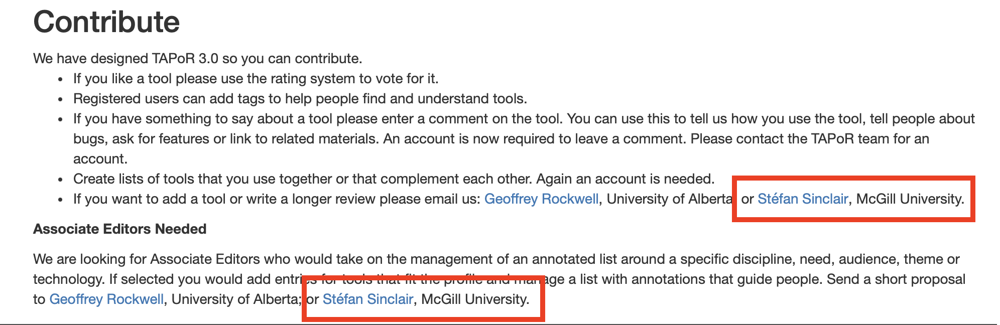
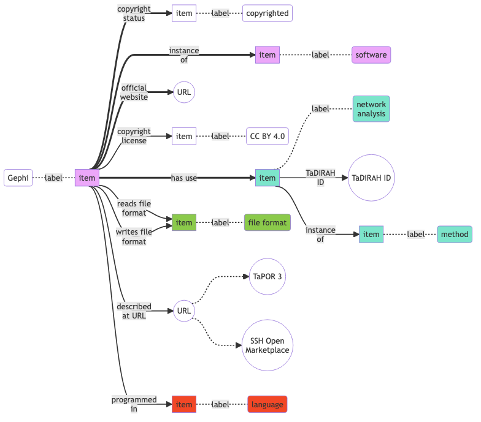

## Überblick

# Warum ein neues Toolverzeichnis?
## Überblick über ein sich kontinuierlich wandelndes Feld

::: columns
:::: column

{#fig:wordcloud-tools}

::::
:::: column

- Toolverzeichnisse bedienen einen evidenten Bedarf
* Informationen zu Werkzeugen: 
    - Was gibt es?
    - Wofür kann es im DH Kontext eingesetzt werden?
* Informationen zum Gebrauch von Werkzeugen: 
    - Wie kann ich das Lernen?
    - Wer hat es wie und mit welchem Ergebnis bereits angewendet?

::::
:::

::: notes

- hier können wir kurz über den Kontext unserer beiden Projekte reden
- FuReSH bzw. Kompetenzwerkstatt DH
- NFDI4Memory Methodenlabor

:::

## Tool Registries sind Legion und ein eigenes Genre der DH

::: columns
:::: column

- DiRT -> Bamboo -> [TAPoR (3.0)][tapor]
- [Social Sciences and Humanities (SSH) Open Marketplace][sshmarketplace]
    + DARIAH, CLARIN, CESSDA
- NFDIs
    + [fortext](https://fortext.net/tools)
    + [NFDI4culture](https://nfdi4culture.de/resources/registry.html)
    + Basisdienste ...
- [Research Software Directory](https://www.esciencecenter.nl/rsd/), Netherlands eScience Center

::::
:::: column

<!-- HIER GGF. SCREENSHOTS VON DEN WEBSITES? -->

::::
:::

::: notes

- Abkürzungen
    + Bamboo DiRT, 2011, 2012--
    + CESSDA: Consortium of European Social Science Data Archives
    + CLARIN: Common Language Resources and Technology Infrastructure
    + DARIAH: Digital Research Infrastructure for the Arts and Humanities, 2011
    + DiRT: Digital Research Tools, 2008--
    + TaDiRAH: developed as collaboration between DiRT and DARIAH-DE, 2013
    + TAPoR: Text Analysis Portal for Research, maintained by Geoffrey Roper
:::


## Schwächen der bestehenden Tool Registries

<!-- Problem: "DiRT trap" [@Dombrowski2021DirectoryParadox] -->

>directories require ongoing upkeep, and it is unrealistic for an individual -- particularly in an alternative academic career track -- to do that work indefinitely. 

<cite>@Dombrowski2021DirectoryParadox</cite>

::: columns
:::: column

- Projektfinanzierung
- Datensilos 
    + Fokus auf Präsentationsschicht
    + Proprietäre bzw. custom Infrastrukturen
    + schlecht dokumentierte oder gar keine Schnittstellen (API's)
    + Kein Normdatensätze
- Kuratierung
    + (unbezahlte) Expert_innen und Gremien
    + praktisch kein community engagement
    + unmöglich Informationen aktuel zu halten

::::
:::: column

{#fig:tapor-about}

{#fig:tapor-contribute}

::::
:::


::: notes

- Sehr eingeschränkter Einsatz von APIs
    + Bsp. TAPoR hat eine nicht-dokumentierte API, auf die wir nur durch eine Analyese des  [ToolXtractor](https://github.com/lehkost/ToolXtractor)  [@BarbotEtAl2019ToolsMentioned; @BarbotEtAl2019WhichDHTools] gestoßen sind.
    + Bsp. SSH Open Marketplace hat eine dokumentierte API, aber es lassen sich nicht alle Werkzeuge abfragen, die mit einem bestimmten TaDiRAH-Konzept kategorisiert sind
- Folge: Momentaufnahme
    + IDs können nicht von externen für LOD benutzt werden 
    + Es können keine neuen Werkzeuge hinzugefügt werden
    + Es gibt keine dauerhafte Maintenance (Finanzierung)
        * Bsp.: TAPoR listet immer noch Stéfan Sinclairs Email für die Einreichung neuer Werkzeuge, obwohl Stéfan im August 2020 verstorben ist.
        * Die API des SSH Open Marketplace liefert `informationContributor` und `lastInfoUpdate`
:::

## Ergebnis

Im Ergebnis sind diese Toolverzeichnisse in dem Anspruch eines umfassenden, representativen und je aktuellen Abbildes der verfügbaren Möglichkeiten computationeller Forschung und digitaler Wissenschaft als gescheitert zu verstehen.

# Unser Vorschlag <br/>ein weiteres Toolverzeichnis
## Wirklich?

{#fig:xkcd-standards}

 <!-- Unser Ansatz: Offene Tool Registry mit Wikidata -->

## Prinzipien des *minimal computing*

::: columns
:::: column

>minimal computing connotes digital humanities work undertaken in the context of some set of constraints. This could include lack of access to hardware or software, network capacity, technical education, or even a reliable power grid.

<cite>[@RisamGil2022Introduction, §3]</cite>

 für luxuriöse Küchen](../assets/images/bulthaupt.png){#fig:bulthaupt}

::::
:::: column


>this implies learning how to produce, disseminate, and preserve digital scholarship ourselves, **without the help we can’t get**, even as we fight to build the infrastructures we need at the intersection of, with, and beyond institutional libraries and schools.

<cite>[@Gil+2016, 29]</cite>

](https://upload.wikimedia.org/wikipedia/commons/thumb/f/f1/SchutteLihotzky_FrankfurtKitchen_MIA_2004195_001.jpg/450px-SchutteLihotzky_FrankfurtKitchen_MIA_2004195_001.jpg){#fig:bauhaus}

::::
:::

## Grundlagen

Wir müssen die Frage "was brauchen *wir*" mit "was haben *wir*" beantworten können

::: columns
:::: {.column .small-font}

### Was brauchen *wir*?

- Toolverzeichnis (s.o.), als Abbild 
    + der sich wandelden *Tool-Landschaft* bzw. *Tool-Bandbreite*
    + des *Toolgebrauchs* in den Digital Humanities, Digital History ...
- Tools sollen
    + beschrieben werden
    + klassifiziert werden
    + referenzierbar sein
    + auffindbar sein
- Einbettung in bestehende Infrastruktur
    + Linked Open Data
    + hohe Sichtbarkeit
    + Community Management

::::
:::: column

### Wer sind *wir*?

+ 4 Personen
+ Projektfinanziert
+ Gemeinschaft von Praktitioners

### Was haben *wir*?

+ Know-how
+ Kontakte
+ Anschubfinanzierung
+ anteilige Arbeitszeit

::::
:::

::: notes

- Funktionen von Toolverzeichnissen
    * Informationen zu Werkzeugen: 
        - Was gibt es?
        - Wofür kann es im DH Kontext eingesetzt werden?
    * Informationen zum Gebrauch von Werkzeugen: 
        - Wie kann ich das Lernen?
        - Wer hat es wie und mit welchem Ergebnis bereits angewendet?

:::

## Vorschlag

::: columns
:::: column

### Was brauchen *wir*?

- Toolverzeichnis (s.o.), als Abbild 
    + der sich wandelden *Tool-Landschaft* bzw. *Tool-Bandbreite*
    + des *Toolgebrauchs* in den Digital Humanities, Digital History ...
- Tools sollen
    + beschrieben werden
    + klassifiziert werden
    + referenzierbar sein
    + auffindbar sein
- Einbettung in bestehende Infrastruktur
    + Linked Open Data
    + hohe Sichtbarkeit
    + Community Management

::::
:::: column

### Was machen wir?

- Setzen alles auf Wikidata auf
    + (Linked) Open Data
    + Community und User Management
    + Multilingual
    + hohe Sichtbarkeit: Suchmaschinen, Integration in Normdateien ([VIAF](https://viaf.org/))
- (Nach)-nutzung bestehender Datensätze
    + Mapping nach Wikidata
        - TAPoR
        - SSH Open Marketplace
        - TaDiRAH
- Entwicklung minimaler Datenmodelle

::::
:::

# Umsetzung
## Community: WikiProject DH Tool Registry

- Anlegen und redaktionelle Betreuung eines WikiProjekts in Wikidata
    - [WikiProject DH Tool Registry](https://www.wikidata.org/wiki/Wikidata:WikiProject\_DH\_Tool_Registry) mit:
        - Landingpage
        - Background
        - Datamodel
        - How to use (mit Beispielqueries)
- Dient der Dokumentation <!--des Datenmodells-->, als Hilfestellung (Beispielqueries) und Diskussionsforum sowie zum Monitoring von Tools

<!-- HIER GGF. EIN VIDEO VOM WIKIPROJEKT -->

## Daten: Wikidata

{#fig:data-model}

::: notes

- Aufnahme eines kleinen exemplarischen Datasets an Tools

:::

## Daten: SPARQL abfragen

```sql
SELECT DISTINCT ?tool ?toolLabel ?method ?methodLabel ?tadirahID WHERE {
  SERVICE wikibase:label { bd:serviceParam wikibase:language "[AUTO_LANGUAGE],en". }
  # select all items that have a TaDiRAH ID and are therefore assumed to be research methods
  ?method p:P9309 ?statement0.
  ?statement0 ps:P9309 ?tadirahID.
  # select all items that have assigned a method from our subset through `has use`
  ?tool wdt:P366 ?method;
        # filter for all items that are an `instance of` "software" or its subclasses
        wdt:P31/wdt:P279* wd:Q7397.  
}
```


<iframe style="width: 80vw; height: 50vh; border: none;" src="https://query.wikidata.org/embed.html#SELECT%20DISTINCT%20%3Ftool%20%3FtoolLabel%20%3Fmethod%20%3FmethodLabel%20%3FtadirahID%20WHERE%20%7B%0A%20%20SERVICE%20wikibase%3Alabel%20%7B%20bd%3AserviceParam%20wikibase%3Alanguage%20%22%5BAUTO_LANGUAGE%5D%2Cen%22.%20%7D%0A%20%20%23%20select%20all%20items%20that%20have%20a%20TaDiRAH%20ID%20and%20are%20therefore%20assumed%20to%20be%20research%20methods%0A%20%20%3Fmethod%20p%3AP9309%20%3Fstatement0.%0A%20%20%3Fstatement0%20ps%3AP9309%20%3FtadirahID.%0A%20%20%23%20select%20all%20items%20that%20have%20assigned%20a%20method%20from%20our%20subset%20through%20%60has%20use%60%0A%20%20%3Ftool%20wdt%3AP366%20%3Fmethod%3B%0A%20%20%20%20%20%20%20%20%23%20filter%20for%20all%20items%20that%20are%20an%20%60instance%20of%60%20%22software%22%20or%20its%20subclasses%0A%20%20%20%20%20%20%20%20wdt%3AP31%2Fwdt%3AP279%2a%20wd%3AQ7397.%20%20%0A%7D%0AORDER%20BY%20ASC%28%3FtadirahID%29%20ASC%28%3FtoolLabel%29%0ALIMIT%2050" referrerpolicy="origin" sandbox="allow-scripts allow-same-origin allow-popups" ></iframe>

## Prototypisches Frontend

- Zugeschnitten auf Einsatz im Beratungskontext der Kompetenzwerkstatt Digital Humanities (KDH)
- Verbesserung der Daten-Zugänglichkeit sowie -Aufbereitung (Portalcharakter)
- Stärkeren Repräsentationscharakter für die KDH (Corporate Design, Hintergrundinformationen zum Projekt, etc.)
    - Wichtig: Daten davon getrennt lassen
- ähnlich zu: 
    - Archivführer Kolonialzeit: <https://archivfuehrer-kolonialzeit.de/>
    - Scholia: <https://scholia.toolforge.org>
- Recherche von Tools
- Kontrolliertes Hinzufügen von Tools über json-Schema

<!-- HIER GGF. EIN Scrennshot oder Screencast VOM FRONTEND
Inhalt der Folie ersetzen oder bearbeiten
 -->


::: notes

- Warum
    + Das Wikidata Frontend ist nicht das Nutzer_innenfreundlichste
    + Über das Frontend kann ich nicht schnell alle Werkzeuge der Registry abfragen
        * Dafür braucht es SPARQL oder ein extra Frontend
        * Wir stellen den SPARQL Query über das WikiProject zur VErfügung (s.o.)

::: 

# Zusammenfassung
## Nachhaltiges Konzept mit dem Ziel ...

- Übertragbar und anwendbar in anderen DH-Kontexten
- Offen und skalierbar:
    - Zugangsperspektive: Jede/r kann Tools recherchieren, editieren, hinzufügen (höchste Open Data Stufe nach 5 Sterne Modell von Tim Berners-Lee).
    - Datenmodellperspektive: Das Modell kann durch die Community erweitert und angepasst werden.
        - Wichtig: Man einigt sich auf ein gemeinsames minimales Datenmodell.
- Modular:
    - Multiple projektspezifische Wikidata-Projekte können angelegt werden.
        - Datenmodell kann um domänspezifischen Krititerien erweitert werden.
    - Multiple projektspezifische Anwendungen können auf Wikidata aufsetzen.
        - Unabhängig von Interfaces.

# Vielen Dank für Ihre Aufmerksamkeit!
-----------------

<!-- QR COde zum WikiProject -->

## Literatur {#refs}


[huberlin]: https://hu-berlin.de/
[scholia]: https://scholia.toolforge.org/
[sshmarketplace]: https://marketplace.sshopencloud.eu/
[tadirah]: https://vocabs.dariah.eu/tadirah/
[tapor]: https://tapor.ca/
[viaf]: https://viaf.org/
[wikidata]: https://wikidata.org/
[4memory]: https://4memory.de/