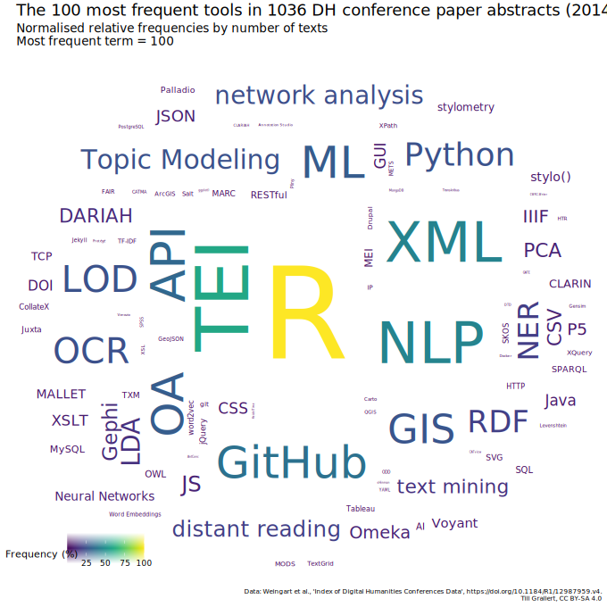

# Hintergrund 
# Wer sind wir? <br/>Und warum bauen **wir** ein weiteres Toolverzeichnis für die Digital Humanities?
## Wer sind wir?

::: columns
:::: column

{style="width:400px"}

::::
:::: column

{style="width:400px"}

::::
:::

## NFDI4Memory

NFDI4Memory fokussiert auf die spezifischen Herausforderungen der **Datafizierung** für:

::: columns
:::: column

### 1. Disziplinen, die ...

... historische Methoden anwenden (also zunächst einmal die Geschichtswissenschaften selbst).

::::
:::: column

### 2. Disziplinen, die ...

... auf Daten angewiesen sind, die eine historische Kontextualisierung erfordern (also so gut wie alle anderen Geistes- und Sozialwissenschaftlichen Disziplinen, inklusive GLAM Institutionen).

::::
:::


::: {.alert .red}

**Datafizierung** bezeichnet den Prozess der zunehmenden Erfassung, Speicherung und Analyse von Daten in allen Bereichen der Gesellschaft, gefördert durch die digitale Transformation und die Entwicklung fortgeschrittener Technologien. Dieser Prozess führt zu einem grundlegenden Wandel in der Generierung, Verarbeitung und Nutzung von Informationen, wobei Daten zu einem zentralen Bestandteil in nahezu allen Aspekten des Lebens und der Arbeit werden.

:::

::: notes

**Datafizierung** bezeichnet den Prozess der zunehmenden Erfassung, Speicherung und Analyse von Daten in allen Bereichen der Gesellschaft, gefördert durch die digitale Transformation und die Entwicklung fortgeschrittener Technologien. Dieser Prozess führt zu einem grundlegenden Wandel in der Generierung, Verarbeitung und Nutzung von Informationen, wobei Daten zu einem zentralen Bestandteil in nahezu allen Aspekten des Lebens und der Arbeit werden.

:::

## Die Task Area "Data culture"


>Aus der **Datafizierung** folgt, dass unsere Arbeit nicht auf das Forschungsdatenmanagement (FDM) verengt werden kann, sondern zugleich von einem datafizierten Forschungsprozess ausgehen müssen. Ein datafizierter Forschungsprozess jedoch bedarf einer gelebten **Datenkultur**.

## Die Task Area "Data culture"

>Aus der **Datafizierung** folgt, dass unsere Arbeit nicht auf das Forschungsdatenmanagement (FDM) verengt werden kann, sondern zugleich von einem datafizierten Forschungsprozess ausgehen müssen. Ein datafizierter Forschungsprozess jedoch bedarf einer gelebten **Datenkultur**.

::: columns
:::: wide

### Ausgangslage

- Nutzung von Forschungsdaten und datengetriebener Methoden in den historisch arbeitenden Fächern noch wenig verbreitet
- Konzept, Inhalt und Potential von Forschungsdaten und deren Nutzen noch weitgehend unbekannt
- Vorbehalte gegen datengetriebene Methoden und die Arbeit mit Forschungsdaten
- Sich stetig verändernder technisch-kultureller Kontext mit neuen Herausforderungen (Digitalität → KI-Zeitalter)

::::
:::: narrow

### Zielstellung

- Den Aufbau einer robusten und nachhaltigen, innovativen und kritisch-reflektierenden Datenkultur in den historisch arbeitenden Fächern fördern und gestalten
- Die Akzeptanz von Forschungsdaten und datengetriebener Forschung erhöhen

::::
:::


## Was meinen wir mit Datenkultur?

>Aus der **Datafizierung** folgt, dass unsere Arbeit nicht auf das Forschungsdatenmanagement (FDM) verengt werden kann, sondern zugleich von einem datafizierten Forschungsprozess ausgehen müssen. Ein datafizierter Forschungsprozess jedoch bedarf einer gelebten **Datenkultur**

::: columns
:::: column

### im weiteren Sinne

eine **Fachkultur**, bei der (Forschungs-)daten und datengetriebener Methoden ein integraler Bestandteil sind, die Arbeit mit und an Daten also nicht mehr als ein netter Appendix zum “eigentlichen” Forschungsprozess verstanden wird.

::::
:::: column

### im engeren Sinne

**alltägliche Praktiken** und Verantwortlichkeiten (auch rechtlich und ethisch) im Umgang mit Forschungsdaten, bei deren Erzeugung, Bereitstellung und Nutzung mit Hilfe von computationellen Methoden und Werkzeugen.


::::
:::

::: columns

### braucht

:::: column

Verständnis der theoretischen und epistemologischen Grundlagen und Implikationen der Datafizierung und Diskussion über deren Folgen

::::
:::: column

Orientierung, Guidelines und Unterstützung

::::
:::

# Werkzeug- und Methodenkritik
## Das Methodenlabor als Experimentierwerkstatt <br/>an der Schnittstelle von Datenkultur im weiteren und engeren Sinn


Forschende brauchen ein klares Verständnis dafür, welche Möglichkeiten (Forschungs-)Daten für ihre Arbeit bieten und welche Anforderungen spezifische Daten an Infrastruktur und Fähigkeiten stellen. Dafür sollen digitale und computationelle Methoden identifiziert und für ihre Anwendung in den historisch arbeitenden Wissenschaften evaluiert, erklärt und (nach)nutzbar bereitgestellt werden.

::: columns

#### Aufgaben

:::: column


- Evaluation und Exploration einzelner Methoden und deren Demonstration und Bereitstellung durch Tutorials und exemplarische Data Stories
- Field Surveys zum Gebrauch von Forschungsdaten und computationellen Methoden in den Geschichtswissenschaften

::::
:::: column

- Austausch mit DH-Zentren
- Förderung kollaborativer Projekte durch gemeinsame Bearbeitung von Fallstudien aus der Community

::::
:::


## 

Die Kompetenzwerkstatt Digital Humanities unterstützt Forscher*innen in allen Fragen computergestützter Forschung in den Geistes- und Kulturwissenschaften. 

Unser Angebot umfasst: 

- individuelle Beratung, 
- Projektberatung, 
- Workshops und Prototypenentwicklung. 

Im Vordergrund steht dabei die Tool Literacy, das heißt die Entwicklung eigener Kompetenzen im Umgang mit digitalen Tools.


::: columns

#### Showcases

:::: column

- [Tool Registry mit Wikidata](https://www.wikidata.org/wiki/Wikidata:WikiProject_DH_Tool_Registry)
- [Heraldik-Projekt mit Infrastrukturaufbau für die digitale Bildsammlung sowie Aufbau einer Online-Forschungsumgebung](https://digitalheraldry.org/)
- [Datasprint mit großen Tweet-Korpora, März 2024](https://www.dnb.de/DE/Professionell/Sammeln/Sammlung_Websites/Twittertagung/twitterDatasprint.html?nn=246608)

::::
:::: column

- [Workshop Hands-On Generative KI mit KDH KI-Playground](https://blogs.hu-berlin.de/furesh/2023/10/18/workshop-hands-on-generative-ki/)
- Workshop OCR4All
- [Vortragsreihe “Werkzeug”](https://hu.berlin/werkzeug)
- Bildmetadaten scrapen mit Selenium

::::
:::

DFG-Projekt 2022-2025

# Toolverzeichnisse in den DH
## Überblick über ein sich kontinuierlich wandelndes Feld

::: columns
:::: column

{#fig:wordcloud-tools}

::::
:::: column

- Toolverzeichnisse bedienen einen evidenten Bedarf
* Informationen zu Werkzeugen: 
    - Was gibt es?
    - Wofür kann es im DH Kontext eingesetzt werden?
* Informationen zum Gebrauch von Werkzeugen: 
    - Wie kann ich das Lernen?
    - Wer hat es wie und mit welchem Ergebnis bereits angewendet?

::::
:::

::: notes

- hier können wir kurz über den Kontext unserer beiden Projekte reden
- FuReSH bzw. Kompetenzwerkstatt DH
- NFDI4Memory Methodenlabor

:::

## Tool Registries sind Legion und ein eigenes Genre der DH

::: columns
:::: column

- DiRT -> Bamboo -> [TAPoR (3.0)][tapor]
- [Social Sciences and Humanities (SSH) Open Marketplace][sshmarketplace]
    + DARIAH, CLARIN, CESSDA
- NFDIs
    + [fortext](https://fortext.net/tools)
    + [NFDI4culture](https://nfdi4culture.de/resources/registry.html)
    + Basisdienste ...
- [Research Software Directory](https://www.esciencecenter.nl/rsd/), Netherlands eScience Center

::::
:::: column

{#fig:websites}

::::
:::

::: notes

- Abkürzungen
    + Bamboo DiRT, 2011, 2012--
    + CESSDA: Consortium of European Social Science Data Archives
    + CLARIN: Common Language Resources and Technology Infrastructure
    + DARIAH: Digital Research Infrastructure for the Arts and Humanities, 2011
    + DiRT: Digital Research Tools, 2008--
    + TaDiRAH: developed as collaboration between DiRT and DARIAH-DE, 2013
    + TAPoR: Text Analysis Portal for Research, maintained by Geoffrey Roper
:::


## Schwächen der bestehenden Tool Registries

<!-- Problem: "DiRT trap" [@Dombrowski2021DirectoryParadox] -->

>directories require ongoing upkeep, and it is unrealistic for an individual -- particularly in an alternative academic career track -- to do that work indefinitely. 

<cite>@Dombrowski2021DirectoryParadox</cite>

::: columns
:::: column

- Projektfinanzierung
- Datensilos 
    + Fokus auf Präsentationsschicht
    + Proprietäre bzw. custom Infrastrukturen
    + schlecht dokumentierte oder gar keine Schnittstellen (API's)
    + Kein Normdatensätze
- Kuratierung
    + (unbezahlte) Expert_innen und Gremien
    + praktisch kein community engagement
    + unmöglich Informationen aktuel zu halten

::::
:::: column

{#fig:tapor-about}

{#fig:tapor-contribute}

::::
:::


::: notes

- Sehr eingeschränkter Einsatz von APIs
    + Bsp. TAPoR hat eine nicht-dokumentierte API, auf die wir nur durch eine Analyese des  [ToolXtractor](https://github.com/lehkost/ToolXtractor)  [@BarbotEtAl2019ToolsMentioned; @BarbotEtAl2019WhichDHTools] gestoßen sind.
    + Bsp. SSH Open Marketplace hat eine dokumentierte API, aber es lassen sich nicht alle Werkzeuge abfragen, die mit einem bestimmten TaDiRAH-Konzept kategorisiert sind
- Folge: Momentaufnahme
    + IDs können nicht von externen für LOD benutzt werden 
    + Es können keine neuen Werkzeuge hinzugefügt werden
    + Es gibt keine dauerhafte Maintenance (Finanzierung)
        * Bsp.: TAPoR listet immer noch Stéfan Sinclairs Email für die Einreichung neuer Werkzeuge, obwohl Stéfan im August 2020 verstorben ist.
        * Die API des SSH Open Marketplace liefert `informationContributor` und `lastInfoUpdate`
:::

## Zusammenfassung

Im Ergebnis sind diese Toolverzeichnisse in dem Anspruch eines umfassenden, representativen und je aktuellen Abbildes der verfügbaren Möglichkeiten computationeller Forschung und digitaler Wissenschaft als gescheitert zu verstehen.

# Unser Vorschlag: <br/>Ein weiteres Toolverzeichnis
## Wirklich?

{#fig:xkcd-standards}

 <!-- Unser Ansatz: Offene Tool Registry mit Wikidata -->

## Grundlagen

Wir müssen die Frage "was brauchen *wir*" mit "was haben *wir*" beantworten können

::: columns
:::: column

### Was brauchen *wir*?

- Toolverzeichnis (s.o.), als Abbild 
    + der sich wandelden *Tool-Landschaft* bzw. *Tool-Bandbreite*
    + des *Toolgebrauchs* in den Digital Humanities, Digital History ...
- Tools sollen
    + beschrieben werden
    + klassifiziert werden
    + referenzierbar sein
    + auffindbar sein
- Einbettung in bestehende Infrastruktur
    + Linked Open Data
    + hohe Sichtbarkeit
    + Community Management

::::
:::: column

### Wer sind *wir*?

+ 4 Personen
+ Projektfinanziert
+ Gemeinschaft von Praktitioners

### Was haben *wir*?

+ Know-how
+ Kontakte
+ Anschubfinanzierung
+ anteilige Arbeitszeit

::::
:::

::: notes

- Funktionen von Toolverzeichnissen
    * Informationen zu Werkzeugen: 
        - Was gibt es?
        - Wofür kann es im DH Kontext eingesetzt werden?
    * Informationen zum Gebrauch von Werkzeugen: 
        - Wie kann ich das Lernen?
        - Wer hat es wie und mit welchem Ergebnis bereits angewendet?

:::

## Hintergrund: *minimal computing*

::: columns
:::: column

>minimal computing connotes digital humanities work undertaken in the context of some set of constraints. This could include lack of access to hardware or software, network capacity, technical education, or even a reliable power grid.

<cite>[@RisamGil2022Introduction, §3]</cite>

 für luxuriöse Küchen](../assets/images/bulthaupt.png){#fig:bulthaupt}

::::
:::: column


>this implies learning how to produce, disseminate, and preserve digital scholarship ourselves, **without the help we can’t get**, even as we fight to build the infrastructures we need at the intersection of, with, and beyond institutional libraries and schools.

<cite>[@Gil+2016, 29]</cite>

](https://upload.wikimedia.org/wikipedia/commons/thumb/f/f1/SchutteLihotzky_FrankfurtKitchen_MIA_2004195_001.jpg/450px-SchutteLihotzky_FrankfurtKitchen_MIA_2004195_001.jpg){#fig:bauhaus}

::::
:::

## Vorschlag

::: columns
:::: {.narrow .small-font}

### Was brauchen *wir*?

- Toolverzeichnis (s.o.), als Abbild 
    + der sich wandelden *Tool-Landschaft* bzw. *Tool-Bandbreite*
    + des *Toolgebrauchs* in den Digital Humanities, Digital History ...
- Tools sollen
    + beschrieben werden
    + klassifiziert werden
    + referenzierbar sein
    + auffindbar sein
- Einbettung in bestehende Infrastruktur
    + Linked Open Data
    + hohe Sichtbarkeit
    + Community Management

::::
:::: wide

### Was machen wir?

- Setzen alles auf [Wikidata][wikidata] auf
    + (Linked) Open Data
    + Community und User Management
    + Multilingualität von Interface und Daten
    + hohe Sichtbarkeit: Suchmaschinen, Integration in Normdateien ([VIAF](https://viaf.org/))
- (Nach)-nutzung bestehender Datensätze
    + Mapping nach Wikidata
        - [TAPoR][tapor]
        - [SSH Open Marketplace][sshmarketplace]
        - [TaDiRAH][tadirah]
- Entwicklung minimaler Datenmodelle

::::
:::

# Umsetzung
## Community: WikiProject DH Tool Registry

::: columns
:::: narrow

![Link zu unserem [WikiProject][wikiproject]](/Users/Shared/BachUni/BachBibliothek/GitHub/FuReSH/slides/assets/qrcodes/url_wikiproject.jpg)

::::
:::: wide

- Anlegen und redaktionelle Betreuung eines WikiProjekts in Wikidata
    - [WikiProject DH Tool Registry](https://www.wikidata.org/wiki/Wikidata:WikiProject\_DH\_Tool_Registry) mit:
        - Landingpage
        - Background
        - Datamodel
        - How to use (mit Beispielqueries)
- Dient der Dokumentation <!--des Datenmodells-->, als Hilfestellung (Beispielqueries) und Diskussionsforum sowie zum Monitoring von Tools

{#fig:wikidata-wikiproject}

::::
:::

## Minimales Datenmodel

::: columns
:::: column
 
- **Software-Werkzeuge** implementieren **Verfahren**
    + stellen Anforderungen an **Hardware** und Infrastrukturen
    + interagieren mit **Formaten** (lesen, schreiben).
    + sind in **Sprachen** geschrieben und benötigen ohne GUI **Sprachen** zur Interaktion.
- Basisdatenmodell als gemeinsame Ausgangslage
- Mapping nach nach [TaDiRAH](https://de.dariah.eu/tadirah) zur Methoden-Zuordnung sowie zur Wiederauffindbarkeit in Wikidata:

>[...] anwendungsorientierte Taxonomie, die unter Einbeziehung der Community dazu dient, Ressourcen aus dem Kontext der digitalen Geisteswissenschaften nach bestimmten Kategorien des Forschungsprozesses klassifizieren zu können. 

::::
:::: column

{#fig:data-model-minimal}

::::
:::

::: notes

- Aufnahme eines kleinen exemplarischen Datasets an Tools

:::

## Erweiterte Datenmodelle

{#fig:data-model-extended}


::: notes

- the **wichtigsten Properties** sind:
- [`described at URL`](https://www.wikidata.org/wiki/Property:P973): link to other tool registries or tutorials
    + tool registries
        * [TaPOR 3][tapor]: URLs follow the pattern `https://tapor.ca/tools/{ID}`, e.g. <https://tapor.ca/tools/171> for Gephi.
        * [SSH Open Marketplace][sshmarketplace]: URLs follow the pattern `https://marketplace.sshopencloud.eu/tool-or-service/{ID}`, e.g. <https://marketplace.sshopencloud.eu/tool-or-service/87wJWo> for Gephi.
- [`used by`](https://www.wikidata.org/wiki/Property:P1535): pointing to items for research papers, software packages, project websites that make use of a specific tool. One can for instance, as we did, query the full corpus of [*Digital Humanities Quarterly*](http://digitalhumanities.org/dhq/), add bibliographical information for papers to Wikidata and then point to the Wikidata item of this paper, e.g. [Daniel Burckhardt "Comparing Disciplinary Patterns: Exploring the Humanities through the Lens of Scholarly Communication"](https://www.wikidata.org/wiki/Q122834645) makes use of Gephi.

:::

## Daten: SPARQL abfragen

```sql
SELECT DISTINCT ?tool ?toolLabel ?tadirahID ?methodLabel ?method
WHERE {
  ?method wdt:P9309 ?tadirahID.
  ?tool wdt:P366 ?method;
    wdt:P31/wdt:P279* wd:Q7397.
  SERVICE wikibase:label { bd:serviceParam wikibase:language "[AUTO_LANGUAGE],en". }
}
ORDER BY ?toolLabel
```


<iframe style="height: 50vh; border: none;" src="https://query.wikidata.org/embed.html#%23defaultView%3AGraph%0ASELECT%20DISTINCT%20%3Ftool%20%3FtoolLabel%20%3FtadirahID%20%3FmethodLabel%20%3Fmethod%0AWHERE%20%7B%0A%20%20%23%20select%20all%20items%20that%20have%20a%20TaDiRAH%20ID%20and%20are%20therefore%20assumed%20to%20be%20methods%0A%20%20%3Fmethod%20wdt%3AP9309%20%3FtadirahID.%0A%20%20%23%20select%20all%20items%20which%20are%20linked%20to%20these%20methods%20through%20%60has%20use%60%0A%20%20%3Ftool%20wdt%3AP366%20%3Fmethod%3B%0A%20%20%20%20%23%20limit%20tools%20to%20software%20in%20the%20broadest%20sense%0A%20%20%20%20wdt%3AP31%2Fwdt%3AP279%2a%20wd%3AQ7397.%0A%20%20SERVICE%20wikibase%3Alabel%20%7B%20bd%3AserviceParam%20wikibase%3Alanguage%20%22%5BAUTO_LANGUAGE%5D%2Cen%22.%20%7D%0A%7D%0AORDER%20BY%20%3FtoolLabel%0ALIMIT%201000" referrerpolicy="origin" sandbox="allow-scripts allow-same-origin allow-popups" ></iframe>

::: notes

- SPARQL query
    1. Fragt alle items ab, die mit TaDiRAH verlinkt sind und die wir deswegen als Methoden / betrachten 
    2. Fragt alle Items ab, die für diese Methoden eingesetzt werden (`has use`)
    3. Label werden in der Systemsprache ausgegeben

:::

## Daten: Demonstration TaDiRAH-Mapping

<!---->

 <video controls autoplay loop width="100%" style="border: 1px solid #cfcfcf;">
  <source src="../assets/video/wikidata-tadirah-mapping-demo.webm" type="video/webm">
  Your browser does not support the video tag.
</video> 

## Prototypisches Frontend

<video controls autoplay loop width="100%" style="border: 1px solid #cfcfcf;">
  <source src="../assets/video/kdh-interface.webm" type="video/webm">
  Your browser does not support the video tag.
</video> 

:::notes

- Warum:
- Zugeschnitten auf Einsatz im Beratungskontext der Kompetenzwerkstatt Digital Humanities (KDH)
- Verbesserung der Daten-Zugänglichkeit sowie -Aufbereitung (Portalcharakter)
    - Das Wikidata Frontend ist nicht das Nutzer_innenfreundlichste
        - Dafür braucht es SPARQL oder ein extra Frontend
        - Wir stellen den SPARQL Query über das WikiProject zur VErfügung (s.o.)
- Stärkeren Repräsentationscharakter für die KDH (Corporate Design, Hintergrundinformationen zum Projekt, etc.)
    - Wichtig: Daten davon getrennt lassen
- ähnlich zu: 
    - Archivführer Kolonialzeit: <https://archivfuehrer-kolonialzeit.de/>
    - Scholia: <https://scholia.toolforge.org>
- Recherche von Tools
- Kontrolliertes Hinzufügen von Tools über json-Schema
- Über das Frontend kann ich nicht schnell alle Werkzeuge der Registry abfragen

::: 

# Zusammenfassung
## Nachhaltiges Konzept mit dem Ziel ...

- Übertragbar und anwendbar in anderen DH-Kontexten
- Offen und skalierbar:
    - Zugangsperspektive: Jede/r kann Tools recherchieren, editieren, hinzufügen (höchste Open Data Stufe nach 5 Sterne Modell von Tim Berners-Lee).
    - Datenmodellperspektive: Das Modell kann durch die Community erweitert und angepasst werden.
        - Wichtig: Man einigt sich auf ein gemeinsames minimales Datenmodell.
- Modular:
    - Multiple projektspezifische Wikidata-Projekte können angelegt werden.
        - Datenmodell kann um domänspezifischen Krititerien erweitert werden.
    - Multiple projektspezifische Anwendungen können auf Wikidata aufsetzen.
        - Unabhängig von Interfaces.

## Vielen Dank für Ihre Aufmerksamkeit!

::: columns
:::: column

### WikiProject

[![Link zu unserem [WikiProject][wikiproject]](../assets/qrcodes/url_wikiproject.jpg)][wikiproject]

::::
:::: column

### Frontend Prototyp

[](https://furesh.github.io/tool-storage-interface/)

::::
:::


## Literatur {#refs}


[huberlin]: https://hu-berlin.de/
[scholia]: https://scholia.toolforge.org/
[sshmarketplace]: https://marketplace.sshopencloud.eu/
[tadirah]: https://vocabs.dariah.eu/tadirah/
[tapor]: https://tapor.ca/
[viaf]: https://viaf.org/
[wikidata]: https://wikidata.org/
[wikiproject]: https://www.wikidata.org/wiki/Wikidata:WikiProject_DH_Tool_Registry
[4memory]: https://4memory.de/