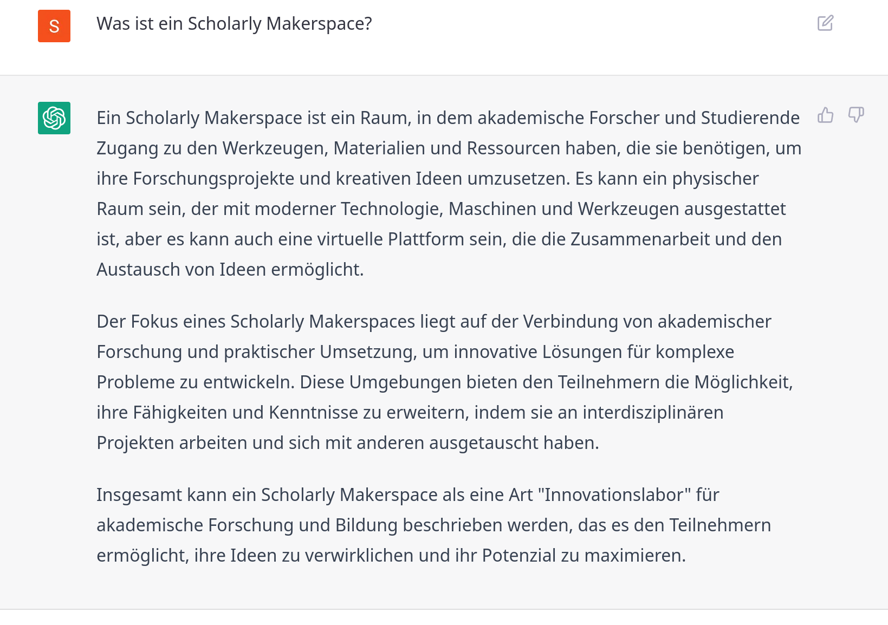

---------

Wir bauen im Rahmen des DFG-Projekts "Future e-Research Support in the Humanities" an der Universitätsbibliothek der Humboldt-Universität zu Berlin unter Beteiligung der Lehrstühle für *Digital History* (Inst.f. Geschichtswissenschaften) und *Information Processing and Analytics* (Inst.f. Bibliotheks- und Informationswissenschaften) einen **prototypischen *Scholarly Makerspace*** zur Förderung **digitaler** und **computationaler Werkzeugkompetenz** (*tool literacy*) in den Geistes- und Kulturwissenschaften auf (2022--25).

::: columns-3
:::: column

::::
:::: column

::::
:::: column

::::
:::

::: notes

- Sophie
    + Museologie, Medieninformatik sowie Digital History (MA)
    + Doktorandin und Wimi am Lehrstuhl Digital History
    + Schwerpunkt auf Research Software Engineering
- Till
    + Geschichte (PhD, MA)
    + Islamwissenschaft, Judaistik und VWL
    + mehr als 10 Jahre Erfahrungen in den DH
        * Global DH, critical DH: unter den Bedingungen des Globalen Südens
        * multilingual DH: vor allem Arabisch und Osmanisch
        * Digitale Editorik, NER
        * Netzwerkanalyse, Stilometrie
        * Data viz
- Sam
    + Bibliotheks- und Informationsmanagement
    + Information Science
    + Außerdem am FID Buch-, Bibliothek-, und Informationswissenschaft angestellt
    + Schwerpunkt
        * User Experience

:::

# Ein prototypischer Scholarly Makerspace?!
## Ein Makerspace?

>Im Wesentlichen geht es bei der Makerbewegung um das Teilen von **Räumen**, **Ressourcen** und **Wissen** innerhalb einer **Gemeinschaft**. Diese Ressourcen stehen Einzelpersonen privat oft nicht zur Verfügung. Die Ermöglichung des Zugangs für alle, stellt so einen zentralen Faktor für eine offene und demokratische Gesellschaft dar. [@Heinzeletal2020Einleitung, 2]

::: notes

Damit sind Makerspaces 
    - *Lernorte*
    - wichtige Schnittstelle zwischen **formellem** und **informellem** Lernen [@Heinzeletal2020Einleitung, 1]

:::

## Ein Makerspace?

::: notes

- Werkstätten für Selbermacher:innen
    + Fab Lab, 
- „Makerspace“ hieß  ursprünglich auch die erste kommerziell betriebene Werkstatt bei der 3D-Drucker  gemietet und genutzt werden konnten (HATCH 2013)

:::

## Ein Makerspace ohne 3D-Drucker?

## Ein **Scholarly** Makerspace!

- als Lernort für die digitale Werkzeugkompetenz in den Humanities
- Fokus auf **digitale** und **computationelle** Aspekte zeitgenössischer Geistes- und Kulturwissenschaften

::: columns
:::: column

::::
:::: column

::::
:::

## Ein **Scholarly** Makerspace
### 1. durch Forschungsfragen getrieben

{height="400px" #fig:word-cloud}

::: notes

- Beispielfragen
    + Wie lassen sich genuin digitale, kulturelle Artefakte für die Zeitgeschichte des 21. Jahrhunderts einsetzen
    + Wie lassen sich (sehr) große Corpora mit *distant reading* statistisch valide erschließen?
    + Wie lassen sich Soziale Medien für die Untersuchung gesellschaftlichen Wandels in repressiven Systemen nutzen?

:::

## Ein **Scholarly** Makerspace 
### 2. die Auswirkungen der Digitalität auf den Erkenntnisprozess untersuchend

](https://furesh.github.io/slides/assets/images/ocr_deutsches-zeitungsportal.png){#fig:ocr}

::: notes

- Beispielfragen
    + Welche Auswirkungen haben OCR Algorithmen und Normalisierung auf die Qualität meines Korpus?
    + Was ist die Auswirkung von abstrahierenden Operationalisierungen für die quantitative Auswertung?

:::

## Ein **Scholarly** Makerspace

### 3. die gesellschaftlichen Auswirkungen und Rahmenbedingungen reflektierend

::: columns
:::: column

{#fig:transformer-model}

::::
:::: column

{#fig:chatgpt}

::::
:::

::: notes

+ Wie hoch ist der Verbrauch natürlicher Ressourcen für das Training einer KI auf die Klassifizierung von Abbildungen in mittelalterlichen Handschriften?
+ Was ist mit dem Einsatz von Sklaverei-ähnlichen Zuständen für die Herstellung und Erhalt der notwendigen technischen Infrastrukturen?
+ Welche Folge hat eine auf Beiträge in den Sozialmedien trainierte KI für die Hausratversicherungen in sozialen Brennpunkten?

:::

## Digitale Werkzeugkompetenz in den Humanities?

>It is our position that the "digital" cannot be understood as a separate domain of culture. If we actually examine the digital [...] we see that today digital information processing is present in every aspect of our lives [@CPCAbout].

- Die Unterscheidung zwischen **digital** und **analog** bzw. hergebrachten Ansätzen ist bedeutungslos geworden [@Berry+2017]
- Sämtliche Aspekte der Forschung sind bereits immer durch Computer re-medialisiert

::: notes

Aspekte / Komponenten computationeller Forschung in den Geistes- und Kulturwissenschaften [@Drucker2021DHCoursebook]

1. Erstellung, Aufbereitung **digitaler Materialien**
2. **computationelle Be- / Verarbeitung** dieser Materialien
3. **Präsentation** der Ergebnisse, der Prozesse und der Materialien

- Es herrscht in der Breite ein Mangel an 
    + **Theorie**: Verständnis des epistemischen Wandels
    + **Methode**: Beherrschung der notwendigen Werkzeuge
    + positivem **Wissen**: Überblick über die Möglichkeiten
- *"Digital" Humanities* als Indikator

:::

## Digitale Werkzeugkompetenz in den Humanities?

>Do artefacts have politics? [@Winner+1980]
>
>Your computer is on fire. Humankind can no longer afford to be lulled into complacency by narratives of techno-utopianism or technoneutrality, or by self-assured and oversimplified evasion. [@Mullaney2021Intro, 4]

::: columns
:::: column

### text2text

Mit OpenAI's [ChatGPT]()

>Ein Scholarly Makerspace ist ein Raum, in dem akademische Forscher und Studierende Zugang zu den Werkzeugen, Materialien und Ressourcen haben, die sie benötigen, um ihre Forschungsprojekte und kreativen Ideen umzusetzen. Es kann ein physischer Raum sein, der mit moderner Technologie, Maschinen und Werkzeugen ausgestattet ist, aber es kann auch eine virtuelle Plattform sein, die die Zusammenarbeit und den Austausch von Ideen ermöglicht.

>Der Fokus eines Scholarly Makerspaces liegt auf der Verbindung von akademischer Forschung und praktischer Umsetzung, um innovative Lösungen für komplexe Probleme zu entwickeln. Diese Umgebungen bieten den Teilnehmern die Möglichkeit, ihre Fähigkeiten und Kenntnisse zu erweitern, indem sie an interdisziplinären Projekten arbeiten und sich mit anderen ausgetauscht haben.

<!-- >Insgesamt kann ein Scholarly Makerspace als eine Art "Innovationslabor" für akademische Forschung und Bildung beschrieben werden, das es den Teilnehmern ermöglicht, ihre Ideen zu verwirklichen und ihr Potenzial zu maximieren. -->

<!-- Mit [you.com](https://you.com/search?q=how+to+write+well&&tbm=youwrite&cfr=write&)

>The humanities are under pressure. In an age of big data and computational power, the traditional methods of hermeneutics--close reading and interpretation--seem quaint. New approaches are needed to engage with the digital world, and one promising avenue is the creation of a prototypical scholarly makerspace.
>
>A makerspace is a place where people can come together to create things using technology. They are often open-ended environments where people can experiment and tinker with new ideas. This type of environment is ideal for exploring digital and computational tools, as well as for developing new ways of thinking about the humanities. -->

<!-- >Digital technology is revolutionizing the way we live, work, and communicate. In particular, digital tools are transforming the humanities by providing new ways of accessing and analyzing information. As academics in the humanities, we need to be literate in these tools in order to keep up with the changing landscape of our discipline.

>The digital transformation presents many challenges for us as scholars. For one thing, we must learn how to use new software and hardware platforms that enable us to access and analyze data more efficiently. Additionally, we need to develop new methods for conducting research that take advantage of the unique capabilities of digital technologies. Finally, we must grapple with the ethical implications of using these technologies in our work.

>Despite these challenges, there are many reasons why developing digital tool literacy is essential for scholars in the humanities today. First and foremost amongst these is that it allows us to do our jobs better – plain and simple. With a better understanding of how to use digital technologies effectively, we can conduct research more efficiently and produce scholarship that is more impactful. Additionally, by being digitally literate we set ourselves apart from other scholars who may not have kept pace with the latest developments. Finally ,as society becomes increasingly digitized it is important that those of us working in those digital spaces have a strong foundation in their use. Only through developing our digital tool literacy can we continue to prosper as academics in the humanties field -->

::::
:::: column

### text2image

Mit OpenAIs [DALL-E](https://openai.com/blog/dall-e/)

::::
:::

::: notes

- DALL-E bassiert auf den GPT (Generative Pre-trained Transformer) Modellen von OpenAI
- GPT-3 wird auch zur Textgenese genutzt
- [Stable Diffusion](https://en.wikipedia.org/wiki/Stable_Diffusion)

:::

## Ziel  Von *digital consumers* zu *digital citizens*

Ziel der Stärkung von *tool literacy* ist:

::: columns-3
:::: column

1. **Teilhabe** an der Digitalität durch computationelle Methoden,

::::
:::: column

2. kritische **Reflexion** über ein neues epistemisches Paradigma,

::::
:::: column

3 Genese **neuer Erkenntnisse**

::::
:::

::: notes

- *digital citizenry* ist von [@Rankin2018PeoplesHistory, 11] geprägt
- kann **nur kollaborativ** adäquat bewältigt werden. 
+ Tool literacy ist extrem aufwändig

:::

## Aber **Making** ?

<!-- >Do politics have artefacts? [@DunbarHester2014LowPower] -->

>To use [...] tools well, we must, in some real sense, understand them better than the tool makers. [...] The best kind of tools are therefore the ones that we make ourselves. [@Tenen2016BluntInstrumentalism, 85]

>Without access to the code, whether because it is proprietary or generated on the fly, as in the case of some machine-learning algorithms, analysts can only comment on the apparent operations of the code based on its effects. The operations of the code are left in the hands of those who can access it, usually those who have made or maintain it, and those who can read it. [@Marino2020CriticalCodeStudies, 4]

::: columns
:::: column

### Making

- Experimentieren, Tüfteln, Ausprobieren, Werkeln 
- Selbstermächtigung mit dem Ziel der (Wieder)Aneignung der Produktionsmittel

::::
:::: column

### Maker turn

Kreativität von Design, Herstellung und Erfahrung von (digitalen) Objekten als From von Wissenschaft

::::
:::

::: notes

- Grundsatz: Werkzeuge und Methoden sind mit Machtverhältnissen verwoben
- Geschichte
    + 1970er Kalifornien: kooperative Werkstätten
    + Recht auf Reparatur
    + DIY: do it yourself culture
    + "Maker Movement Manifesto" von Hatch (2013)
        * make, share, give, learn, tool up, play, participate, support, change
- bezieht sich auf [@Wythoff2022MinimalComputing], der die beiden Fragen verknüpft hat
    + Do artefacts have politics? [@Winner+1980]
    + Do politics have artefacts? [@DunbarHester2014LowPower]
- Kritik an Maker culture als omnipotenter maskuliner Raum:
    - >knowledge of circuitry is often conflated with (superheroic) command over people, situations, and things. In present-day “maker” cultures, consider the ubiquity of remarks such as “getting under the hood” or “knowing the nuts and bolts,” which tend to fuse logic with mastery, control with masculinity, engineering with rationality, and programming with revealing. [@Sayers2017Introduction, 3]

:::

## Ein **prototypischer** Scholarly Makerspace

::: columns
:::: narrow

::::
:::: wide

- Fokus auf Übertragbarkeit und Nachnutzbarkeit
    + Nur das absolut Notwendige selber machen
    + Nutzung bestehender offener Infrastrukturen
    + Modulares System
    + Dokumentation, Dokumentation, Dokumentation
    + Open Data und Open Science von Anfang an
- Begleitende Studien
    + Forschungs- und Projektseminare

::::
:::

# Schluß / Danke!
## Weitere Informationen

::: columns
:::: column

### Orte

- *Scholarly Makerspace* im Grimm-Zentrum: Raum 3D (ohne Drucker)
- Webseite: [makerspace.hypotheses.org](https://makerspace.hypotheses.org/)

::::
:::: column

### Folien

- [Was ist ein protoypischer *Scholarly Makerspace*?](scholarly-makerspace.html)
- [Unser Serviceportfolio](service-profil.html)
- [Wie sieht das Tüfteln aus?](operationalisierung.html)
- [Unser Backend](infrastruktur.html)

::::
:::

## Literatur {#refs}