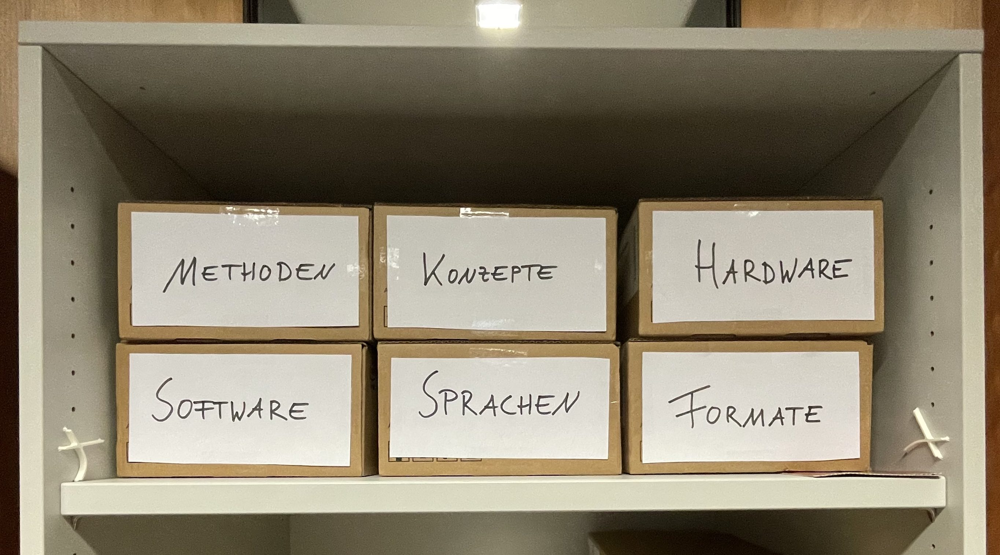
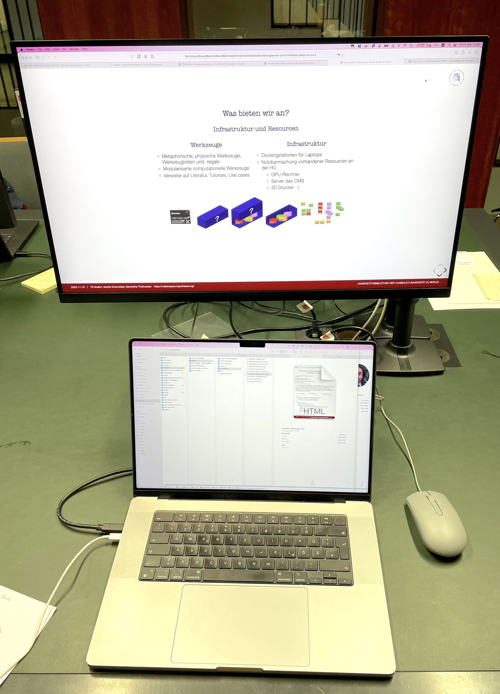

---------

Wir bauen im Rahmen des DFG-Projekts "Future e-Research Support in the Humanities" an der Universitätsbibliothek der Humboldt-Universität zu Berlin unter Beteiligung der Lehrstühle für *Digital History* (Inst.f. Geschichtswissenschaften) und *Information Processing and Analytics* (Inst.f. Bibliotheks- und Informationswissenschaften) einen **prototypischen *Scholarly Makerspace*** zur Förderung **digitaler** und **computationaler Werkzeugkompetenz** (*tool literacy*) in den Geistes- und Kulturwissenschaften auf (2022--25).

::: columns-3
:::: column

::::
:::: column

::::
:::: column

::::
:::

::: notes

- Sophie
    + Museologie, Medieninformatik sowie Digital History (MA)
    + Doktorandin und Wimi am Lehrstuhl Digital History
    + Schwerpunkt auf Research Software Engineering
- Till
    + Geschichte (PhD, MA)
    + Islamwissenschaft, Judaistik und VWL
    + mehr als 10 Jahre Erfahrungen in den DH
        * Global DH, critical DH: unter den Bedingungen des Globalen Südens
        * multilingual DH: vor allem Arabisch und Osmanisch
        * Digitale Editorik, NER
        * Netzwerkanalyse, Stilometrie
        * Data viz
- Sam
    + Bibliotheks- und Informationsmanagement
    + Information Science
    + Außerdem am FID Buch-, Bibliothek-, und Informationswissenschaft angestellt
    + Schwerpunkt
        * User Experience

:::

# Ein prototypischer Scholarly Makerspace?!
## Ein Makerspace?

>Im Wesentlichen geht es bei der Makerbewegung um das Teilen von **Räumen**, **Ressourcen** und **Wissen** innerhalb einer **Gemeinschaft**. Diese Ressourcen stehen Einzelpersonen privat oft nicht zur Verfügung. Die Ermöglichung des Zugangs für alle, stellt so einen zentralen Faktor für eine offene und demokratische Gesellschaft dar. [@Heinzeletal2020Einleitung, 2]

::: notes

Damit sind Makerspaces 
    - *Lernorte*
    - wichtige Schnittstelle zwischen **formellem** und **informellem** Lernen [@Heinzeletal2020Einleitung, 1]

:::

## Ein Makerspace ohne 3D-Drucker?

## Ein **Scholarly** Makerspace als Lernort für die digitale Werkzeugkompetenz in den Humanities

Fokus auf **digitale** und **computationelle** Aspekte zeitgenössischer Geistes- und Kulturwissenschaften

::: columns
:::: column

- durch Forschungsfragen getrieben

<!--  -->

::::
:::: column

- die Auswirkungen der Digitalität auf den Erkenntnisprozess untersuchend

](https://furesh.github.io/slides/assets/images/ocr_deutsches-zeitungsportal.png)

::::
:::

- die gesellschaftlichen Auswirkungen und Rahmenbedingungen reflektierend

::: notes

- durch Forschungsfragen getrieben:
    + Wie lassen sich genuin digitale, kulturelle Artefakte für die Zeitgeschichte des 21. Jahrhunderts einsetzen
    + Wie lassen sich (sehr) große Corpora mit *distant reading* statistisch valide erschließen?
    + Wie lassen sich Soziale Medien für die Untersuchung gesellschaftlichen Wandels in repressiven Systemen nutzen?
- die Auswirkungen auf den Erkenntnisprozess untersuchend:
    + Welche Auswirkungen haben OCR Algorithmen und Normalisierung auf die Qualität meines Korpus?
    + Was ist die Auswirkung von abstrahierenden Operationalisierungen für die quantitative Auswertung?
- die gesellschaftlichen Auswirkungen untersuchend?
    + Wie hoch ist der Verbrauch natürlicher Ressourcen für das Training einer KI auf die Klassifizierung von Abbildungen in mittelalterlichen Handschriften?
    + Was ist mit dem Einsatz von Sklaverei-ähnlichen Zuständen für die Herstellung und Erhalt der notwendigen technischen Infrastrukturen?
    + Welche Folge hat eine auf Beiträge in den Sozialmedien trainierte KI für die Hausratversicherungen in sozialen Brennpunkten?

:::

## Digitale Werkzeugkompetenz in den Humanities?

>It is our position that the "digital" cannot be understood as a separate domain of culture. If we actually examine the digital [...] we see that today digital information processing is present in every aspect of our lives [@CPCAbout].

- Die Unterscheidung zwischen **digital** und **analog** bzw. hergebrachten Ansätzen ist bedeutungslos geworden [@Berry+2017]
- Sämtliche Aspekte der Forschung sind bereits immer durch Computer re-medialisiert

::: notes

- diese Folie erklärt warum wir uns mit digital tool literacy beschäftigen müssen
    + eigentlich schon aus der vorhergehenden Folio über die Beispiele klar

- Aspekte / Komponenten computationeller Forschung in den Geistes- und Kulturwissenschaften [@Drucker2021DHCoursebook]
    1. Erstellung, Aufbereitung **digitaler Materialien**
    2. **computationelle Be- / Verarbeitung** dieser Materialien
    3. **Präsentation** der Ergebnisse, der Prozesse und der Materialien

- Es herrscht in der Breite ein Mangel an 
    + **Theorie**: Verständnis des epistemischen Wandels
    + **Methode**: Beherrschung der notwendigen Werkzeuge
    + positivem **Wissen**: Überblick über die Möglichkeiten
- *"Digital" Humanities* als Indikator

:::

## Digitale Werkzeugkompetenz in den Humanities!

>Do artefacts have politics? [@Winner+1980]

>The Cloud *is* a factory. Your AI *is* a human. Sexism *is* a feature, not a bug. [@Mullaney2021Intro, 7]

Stärkung der *tool literacy* (Werkzeugkompetenz) für:

::: columns-3
:::: wide

+ **Teilhabe** an der Digitalität durch computationelle Methoden,
+ kritische **Reflexion** über ein neues epistemisches Paradigma,
+ Genese **neuer Erkenntnisse**

::::
:::: narrow

::::

:::: narrow

 generiertes Bild<!--: "knight sitting in a student library, wearing in a Renaissance full body armour, with a closed tournament helmet, frantically tipping into an large desktop computer from the 2000s on the table in front of him" (Quelle: Torsten Hiltmann)-->](https://furesh.github.io/slides/assets/images/dell-e_knight.png)

::::
:::

## Aber **Making** ?

<!-- >Do politics have artefacts? [@DunbarHester2014LowPower] -->

>To use [...] tools well, we must, in some real sense, understand them better than the tool makers. [...] The best kind of tools are therefore the ones that we make ourselves. [@Tenen2016BluntInstrumentalism, 85]

>Without access to the code, whether because it is proprietary or generated on the fly, as in the case of some machine-learning algorithms, analysts can only comment on the apparent operations of the code based on its effects. The operations of the code are left in the hands of those who can access it, usually those who have made or maintain it, and those who can read it. [@Marino2020CriticalCodeStudies, 4]

::: columns
:::: column

### Making

- Experimentieren, Tüfteln, Ausprobieren, Werkeln 
- Selbstermächtigung mit dem Ziel der (Wieder)Aneignung der Produktionsmittel

::::
:::: column

### Maker turn

Kreativität von Design, Herstellung und Erfahrung von (digitalen) Objekten als From von Wissenschaft

::::
:::

::: notes

- Grundsatz: Werkzeuge und Methoden sind mit Machtverhältnissen verwoben
- Geschichte
    + 1970er Kalifornien: kooperative Werkstätten
    + Recht auf Reparatur
    + DIY: do it yourself culture
    + "Maker Movement Manifesto" von Hatch (2013)
        * make, share, give, learn, tool up, play, participate, support, change
- bezieht sich auf [@Wythoff2022MinimalComputing], der die beiden Fragen verknüpft hat
    + Do artefacts have politics? [@Winner+1980]
    + Do politics have artefacts? [@DunbarHester2014LowPower]
- Kritik an Maker culture als omnipotenter maskuliner Raum:
    - >knowledge of circuitry is often conflated with (superheroic) command over people, situations, and things. In present-day “maker” cultures, consider the ubiquity of remarks such as “getting under the hood” or “knowing the nuts and bolts,” which tend to fuse logic with mastery, control with masculinity, engineering with rationality, and programming with revealing. [@Sayers2017Introduction, 3]

:::

## Zusammenfassung
### Von *digital consumers* zu *digital citizens*

::: columns
:::: column

::::
:::: column

Aufgaben

- den epistemischen Wandel ergreifen
- Blackboxes öffnen
- Wissensdomäne massiv ausweiten 

Angebot: Hilfe zur Selbsthilfe

- Infrastruktur und Resourcen für eigenes Arbeiten
- gemeinsames Tüfteln
- Vernetzung

::::
:::
::: notes

- *digital citizenry* ist von [@Rankin2018PeoplesHistory, 11] geprägt
- kann **nur kollaborativ** adäquat bewältigt werden. 
+ Tool literacy ist extrem aufwändig

:::

# Wie sieht das konkret aus?
## Wer sind unsere Zielgruppen?

Forscher_innen aller Karrierstufen ab der Promotionsphase

::: columns-3
:::: column

### Typ 1

Keine / geringe Kenntnisse aber Interesse an Digital Humanities

::::
:::: column

### Typ 2

Detaillierte Vorstellungen aber mangelnde Kenntnisse für konkrete Umsetzung

::::
:::: column

### Typ 3

Detaillierte Kenntnisse aber mangelnder Zugang zu Infrastrukturen

::::
:::

## Was bieten wir an?
### Einen Lernort

Der *Scholarly Makerspace* ist seit dem 14. November montags, mittwochs und donnerstags von 10 bis 14 Uhr geöffnet

::: columns
:::: column

::::
:::: column

::::
:::

## Was bieten wir an?
### Hilfe zur Selbsthilfe

::: columns-3
:::: column

### Infrastruktur

und Resourcen für eigenes Arbeiten

+ wöchentliche Einführungen in den Scholarly Makerspace
+ offene Materialien und Infrastrukturen für die Nachnutzung und Erweiterung
<!-- + Zugang zu technischen Infrastrukturen der HU (z.B. CMS) -->

::::
:::: column

### gemeinsames Tüfteln

+ Drop-in
+ Offene Sprechstunde
+ gezielte Beratung

::::
:::: column

### Vernetzung

in die DH Community in Berlin und beyond

+ Community hours für den Austausch
+ [Veranstaltungskalender](https://makerspace.hypotheses.org/324)

::::
:::

::: notes

- bestehende Vernetzungen
    + Hackathon zur Archivierung von Ukrainischem Kulturgut 
        * in den Räumen des IfG
    + SPK Lab Partner
    + Stiftung für die deutsche Wissenschaft (in der Folge des Hackathons)
    + ADA Lovelace Center
        * gemeinsamer jour fixe
        * Veranstaltung zu Kulturen des Scheiterns
    - SUB Hamburg, Symposium "Wissen Bauen 2025"
:::

## Was bieten wir an
### Erfahrungen und Wissen

::: columns-3
:::: column

::::
:::: column

::::
:::: column

::::
:::

::: notes

- wichtig für den gemeinschaftlichen Ansatz ist es, diesen nicht hierarchisch zu denken
    + wir das Personal sind nicht die Experten, die frontal erklären
- >To say, “I can do first aid,” is to underscore our entanglement with circuitry. And to say, “I don’t know all the circuitry,” at least implies the impossibility of such knowledge. That is, we can reject the autonomy or privacy of technologies without supposing we know them completely. Although we may understand how something works, we may not apprehend how or under what conditions it was made. [@Sayers2017Introduction, 2]
- >knowledge of circuitry is often conflated with (superheroic) command over people, situations, and things. In present-day “maker” cultures, consider the ubiquity of remarks such as “getting under the hood” or “knowing the nuts and bolts,” which tend to fuse logic with mastery, control with masculinity, engineering with rationality, and programming with revealing. [@Sayers2017Introduction, 3]

:::

## Was bieten wir an?
### Infrastruktur und Resourcen

::: columns
:::: column

### Werkzeuge

- Modularisierte Werkzeuge, Werkzeugkisten und -regale
- Verweise auf Literatur, Tutorials, Use cases

::::
:::: column

### Infrastruktur

- Dockingstationen für Laptops
- Nutzbarmachung vorhandener Resourcen an der HU
    + GPU-Rechner und Server
    + 3D Drucker :-)

<!--  -->

::::
:::

::: notes

Hinsichtlich der Ressourcen denken wir den Makerspace zweiteilig:

1. zum einen wollen wir Infrastrukturen vor Ort zur Verfügung stellen (Hardware, mit der gearbeitet werden kann, aktuell Dockingstations, kann durchaus erweitert werden z.B. 3D-Drucker, wenn Bedarf da ist), aber auch vorhandene Infrastrukturangebote an der HU nutzbar machen (Zugang zu GPU-Rechenkapazitäten, Server des CMS, etc.)
2. zum anderen aggregieren wir bei uns digitale Werkzeuge, welche im geisteswissenschaftlichen Forschungsprozess zum Einsatz kommen
    * wobei wir Werkzeuge metaphorisch als physisch denken und diese entsprechend nach Werkzeugkisten  und -regale systematisieren
    * daneben gibt es Werkzeuganleitungen, die aus Literatur, Tutorials und Best Practices bestehen

:::

## Was bieten wir nicht an?

::: columns
:::: column

::::
:::: column

- Wir haben keine 3D Drucker
- Wir schreiben keine Anträge
- Wir setzen keine Projekte um
- Wir machen keinen dauerhaften Support
- Wir bauen und hosten keine Werkzeuge
- Wir bauen keine Webseiten

::::
:::

::: notes

- Wir können Kontakt zu Leuten mit 3D Druckern herstellen

:::

# Schluß / Danke!
## Weitere Informationen

::: columns
:::: column

### Orte

- *Scholarly Makerspace* im Grimm-Zentrum: Raum 3D (ohne Drucker)
- Webseite: [makerspace.hypotheses.org](https://makerspace.hypotheses.org/)

::::
:::: column

### Folien

- [Was ist ein protoypischer *Scholarly Makerspace*?](https://furesh.github.io/slides/darstellung/scholarly-makerspace.html)
- [Unser Serviceportfolio](https://furesh.github.io/slides/darstellung/service-profil.html)
- [Wie sieht das Tüfteln aus?](https://furesh.github.io/slides/darstellung/operationalisierung.html)
- [Unser Backend](https://furesh.github.io/slides/darstellung/infrastruktur.html)

### Material

- [Blackboxes zum Ausprobieren](https://furesh.github.io/blackbox-gamification/)

::::
:::

## Literatur {#refs}