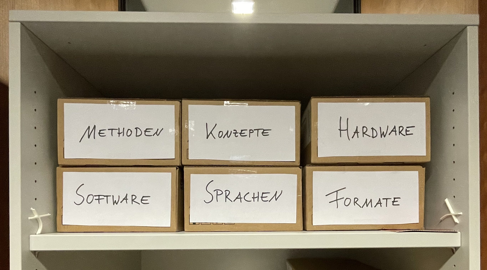
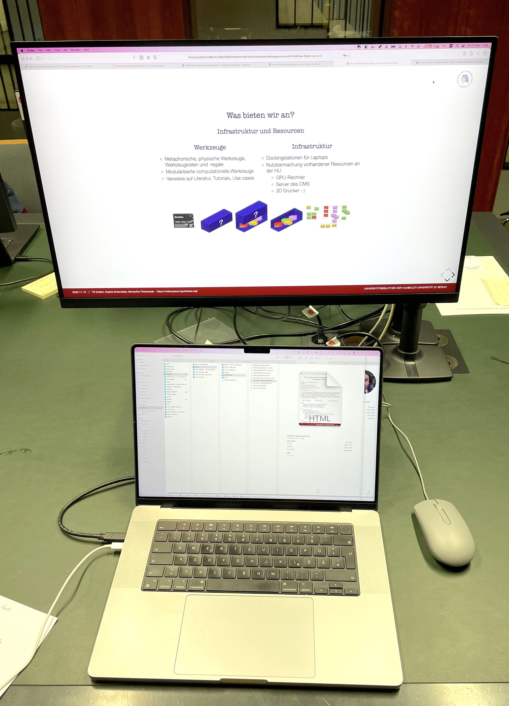

---------

Wir bauen im Rahmen des DFG-Projekts "Future e-Research Support in the Humanities" an der Universitätsbibliothek der Humboldt-Universität zu Berlin unter Beteiligung der Lehrstühle für *Digital History* (Inst. f. Geschichte) und *Information Processing and Analytics* (Inst.f. Bibliotheks- und Informationswissenschaften) einen **prototypischen *Scholarly Makerspace*** zur Förderung **digitaler** und **computationaler Werkzeugkompetenz** (*tool literacy*) in den Geistes- und Kulturwissenschaften auf (2022--25).

::: columns-3
:::: column

::::
:::: column

::::
:::: column

::::
:::

::: notes

- Sophie
    + Museologie, Medieninformatik sowie Digital History (MA)
    + Doktorandin und Wimi am Lehrstuhl Digital History
    + Schwerpunkt auf Research Software Engineering
- Till
    + Geschichte (PhD, MA)
    + Islamwissenschaft, Judaistik und VWL
    + mehr als 10 Jahre Erfahrungen in den DH
        * Global DH, critical DH: unter den Bedingungen des Globalen Südens
        * multilingual DH: vor allem Arabisch und Osmanisch
        * Digitale Editorik, NER
        * Netzwerkanalyse, Stilometrie
        * Data viz
- Sam
    + Bibliotheks- und Informationsmanagement
    + Information Science
    + Außerdem am FID Buch-, Bibliothek-, und Informationswissenschaft angestellt
    + Schwerpunkt
        * User Experience

:::

# Serviceportfolio
## Was bieten wir an?
### Einen Lernort

Der *Scholarly Makerspace* ist seit dem 14. November montags bis freitags von 10 bis 14 Uhr geöffnet

::: columns
:::: column

::::
:::: column

::::
:::

::: notes

- Makerspace als Lernort
- Wichtig beim Scholarly Makerspace ist der konkrete, physische Raum, in dem letztlich Austausch und Vernetzung der Community stattfinden können
+ Herausforderung: 
    * bzgl. Des Bibliotheksbau in Berlin (Grimm-Zentrum) die Bibliothek traditionell gedacht und geplant wurde, d.h. diese neuen Räume müssen erst geschaffen werden (nicht frei von Konflikten abläuft)
+ Anforderungen: angenehme Atmosphäre
        * Platz
        * Licht
        * Schallschutz
        * Gruppenarbeitsplätze
        * "Werkbänke"

:::

## Wer sind unsere Zielgruppen?

Forscher_innen aller Karrierstufen ab der Promotionsphase

::: columns-3
:::: column

### Typ 1

Keine / geringe Kenntnisse aber Interesse an Digital Humanities

::::
:::: column

### Typ 2

Detaillierte Vorstellungen aber mangelnde Kenntnisse für konkrete Umsetzung

::::
:::: column

### Typ 3

Detaillierte Kenntnisse aber mangelnder Zugang zu Infrastrukturen

::::
:::

## Was bieten wir an?
### Hilfe zur Selbsthilfe

::: columns-3
:::: column

### Infrastruktur

und Resourcen für eigenes Arbeiten

+ wöchentliche Einführungen in den Scholarly Makerspace
+ offene Materialien und Infrastrukturen für die Nachnutzung und Erweiterung
<!-- + Zugang zu technischen Infrastrukturen der HU (z.B. CMS) -->

::::
:::: column

### gemeinsames Tüfteln

+ Drop-in
+ Offene Sprechstunde
+ gezielte Beratung

::::
:::: column

### Vernetzung

in die DH Community in Berlin und beyond

+ Community hours für den Austausch
+ [Veranstaltungskalender](https://makerspace.hypotheses.org/324)

::::
:::

::: notes

- bestehende Vernetzungen
    + Hackathon zur Archivierung von Ukrainischem Kulturgut 
        * in den Räumen des IfG
    + SPK Lab Partner
    + Stiftung für die deutsche Wissenschaft (in der Folge des Hackathons)
    + ADA Lovelace Center
        * gemeinsamer jour fixe
        * Veranstaltung zu Kulturen des Scheiterns
    - SUB Hamburg, Symposium "Wissen Bauen 2025"
:::

## Was bieten wir an
### Erfahrungen und Wissen

::: columns-3
:::: column

::::
:::: column

::::
:::: column

::::
:::

::: notes

- wichtig bei Bereitstellung für uns, diese nicht hierarchisch zu denken
    + wir das Personal sind nicht die Experten, die frontal erklären
- >To say, “I can do first aid,” is to underscore our entanglement with circuitry. And to say, “I don’t know all the circuitry,” at least implies the impossibility of such knowledge. That is, we can reject the autonomy or privacy of technologies without supposing we know them completely. Although we may understand how something works, we may not apprehend how or under what conditions it was made. [@Sayers2017Introduction, 2]
- >knowledge of circuitry is often conflated with (superheroic) command over people, situations, and things. In present-day “maker” cultures, consider the ubiquity of remarks such as “getting under the hood” or “knowing the nuts and bolts,” which tend to fuse logic with mastery, control with masculinity, engineering with rationality, and programming with revealing. [@Sayers2017Introduction, 3]

:::

## Was bieten wir an?
### Infrastruktur und Resourcen

::: columns
:::: column

### Werkzeuge

- Metaphorische, physische Werkzeuge, Werkzeugkisten und -regale
- Modularisierte computationelle Werkzeuge
- Verweise auf Literatur, Tutorials, Use cases

::::
:::: column

### Infrastruktur

- Dockingstationen für Laptops
- Nutzbarmachung vorhandener Resourcen an der HU
    + GPU-Rechner und Server
    + 3D Drucker :-)

<!--  -->

::::
:::

::: notes

Hinsichtlich der Ressourcen denken wir den Makerspace zweiteilig:

1. zum einen wollen wir Infrastrukturen vor Ort zur Verfügung stellen (Hardware, mit der gearbeitet werden kann, aktuell Dockingstations, kann durchaus erweitert werden z.B. 3D-Drucker, wenn Bedarf da ist), aber auch vorhandene Infrastrukturangebote an der HU nutzbar machen (Zugang zu GPU-Rechenkapazitäten, Server des CMS, etc.)
2. zum anderen aggregieren wir bei uns digitale Werkzeuge, welche im geisteswissenschaftlichen Forschungsprozess zum Einsatz kommen
    * wobei wir Werkzeuge metaphorisch als physisch denken und diese entsprechend nach Werkzeugkisten  und -regale systematisieren
    * daneben gibt es Werkzeuganleitungen, die aus Literatur, Tutorials und Best Practices bestehen

:::

## Was bieten wir nicht an?

::: columns
:::: column

::::
:::: column

- Wir haben keine 3D Drucker
- Wir schreiben keine Anträge
- Wir setzen keine Projekte um
- Wir machen keinen dauerhaften Support
- Wir bauen und hosten keine Werkzeuge
- Wir bauen keine Webseiten

::::
:::

::: notes

- Wir können Kontakt zu Leuten mit 3D Druckern herstellen

:::

# Schluß / Danke!
## Weitere Informationen

- [Was ist ein protoypischer *Scholarly Makerspace*?](scholarly-makerspace.html)
- [Unser Serviceportfolio](service-profil.html)
- [Wie sieht das Tüfteln aus?](operationalisierung.html)
- [Unser Backend](infrastruktur.html)

## Literatur {#refs}