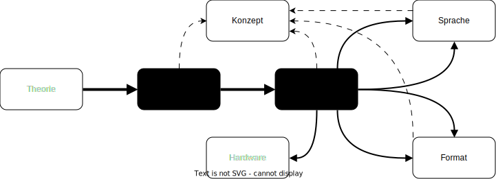

## Idee

(bekannt) Erstellung einer offenen, Wikidata-basierten Tool Registry im Rahmen des Aufbaus eines **prototypischen** Scholarly Makerspace.

# Zielstellung

## Anforderungen

::: columns
:::: column

### Inhalte

- Tools minimal formal beschreiben sowie aggregieren
- Tools kategorisiert (z.B. nach [TaDiRAH](https://vocabs.dariah.eu/tadirah)) sammeln und auffindbar machen
    - in erster Linie als Arbeitsgrundlage / Wissensspeicher für den Makerspace im Kontext von Beratungen
- Wachsender Survey einer *Tool-Landschaft* bzw. *Tool-Bandbreite*: Welche Tools existieren überhaupt zu einem bestimmten Verfahren?

::::
:::: column

### Nachhaltige Infrastruktur

- Nutzung vorhandener Informationen
    + vorzugsweise LOD
- Unsere Daten als Beitrag zu *digital commons*
- Dokumentation einer exemplarischen, offenen Infrastruktur für die Nutzung durch andere

::::
:::

 
## Was ist daran neu?

::: columns
:::: column

### Bisher

Tool registries sind Legion: 

- DiRT -> Bamboo -> [TAPoR (3.0)](https://tapor.ca/) [@GrantEtAl2020AbsorbingDiRT]
- *Social Sciences and Humanities Open Marketplace*](https://marketplace.sshopencloud.eu)

Problem: "DiRT trap" [@Dombrowski2021DirectoryParadox]

- Geschlossene Systeme
- Anspruch der Vollständigkeit
- Funding

::::
:::: column

### Unser Ansatz

Auf allen Ebenen offen

- **Open Data**
    - Bereitstellung (Zugang), 
    - Bearbeitung, 
    - Nachnutzung sowie Interoperabilität
- Infrastruktur
    + Wikidata
    + APIs, SPARQL

::::
:::

## Werkzeugbegriff

<!-- - Software, mit der bestimmte Verfahren praktisch umgesetzt werden und die in der geistes- und kulturwissenschaftlichen Forschung zum Einsatz kommen (z.B. 3D-Modelling, Topic Modelling, Stilometrie, Netzwerkanalyse, Digital Publishing)
- Die Verfahren beziehen sich auf alle Verfahren im Forschungsprozess, also von Datenbeschaffung und -aufbereitung über die Analyse und Interpretation bis hin zur Präsentation und Veröffentlichung
- Beispiel für solche Software kann sein:
    - Open Refine
    - Gephi
    - Voyant Tools
    - Passim
    - Wordpress
    - etc. -->

::: columns
:::: column

**Software**

+ setzt **Verfahren** praktisch um
+ benötigt Hardware, weitere Software
+ interagiert mit **Formaten**
+ Bsp.: Gephi, VoyantTools, passim ...

::::
:::: column

**Verfahren** 

- sind Teil von Methoden der geistes- und kulturwissenschaftlichen Forschung
+ Bsp.: 3D-Modelling, Topic Modelling, Stilometrie, Netzwerkanalyse, Digital Publishing ...

::::
:::

## praktische Ziele

1. exemplarische Infrastruktur auf der Basis von Wikidata, inkl.
    + minimaler Datenmodelle
    + Front-end / Webanwendung?
    + Pipeline zum Druck von Setcards?
    + Social-Media Bots für Dateneingabe und Werbung?
2. exemplarischer Datensatz, inkl.
    + mapping von TaDiRAH nach Wikidata
    + mapping von SSH Open Marketplace (und damit TaPOR) nach Wikidata?
3. detailliert Dokumentation der Infrastruktur und Workflows
    + im Rahmen eines Wikiprojects
    + als unabhängige Publikation

<!-- Ziel ist ein allgemeingültiges minimales Datenmodell in Wikidata mit ersten exemplarisch verzeichneten Tools. -->

::: notes

- zu 2.
    + wir haben das vorhandene Mapping von TaDiRAH zu Wikidata in Wikidata gespiegelt
    + wir haben bereits 500+ Tools aus dem Datensatz mit Wikidata rekonziliiert

:::

## Prototypisch, weil...

- übertragbar und anwendbar in anderen Makerspace-Kontexten (oder gänzlich anderen Projektkontexten wie FID)
    - offen und skalierbar:
        - Zugangsperspektive: jede/r kann Tools editieren und hinzufügen
        - Datenmodellperspektive: Das Modell kann in später erweitert werden (z.B. in einer zweiten Projektphase dahingehend, Pfadabhängigkeiten zu modellieren)
    - modular: 
        - multiple projektspezifische Wikidata-Projekte können angelegt werden
        - multiple projektspezifische Webanwendungen können auf Wikidata aufsetzen

# Grobstruktur

## in Wikidata
    
- Anlegen und redaktionelle Betreuung eines WikiProjects
    - [WikiProject DH Tool Registry](https://www.wikidata.org/wiki/Wikidata:WikiProject_DH_Tool_Registry)
    - dient zur Dokumentation <!--des Datenmodells-->, als Hilfestellung und Diskussionsforum sowie zum Monitoring von Tools, die im Scholary Makerspace in Beratungskontexten verwendet werden
- Aufnahme eines kleinen exemplarischen Datasets an Tools

## Webanwendung (auf Wikidata aufsitzend)

- Verbesserung der Daten-Zugänglichkeit (Portalcharakter)
- Repräsentationscharakter für den Scholarly Makerspace (Corporate Design, Hintergrundinformationen zum Projekt, etc.)
    - ähnlich zu 
        + Archivkolonialführer: <https://archivfuehrer-kolonialzeit.de/>
        + Scholia: <https://scholia.toolforge.org>
- Recherche von Tools
- (ggf. kontrolliertes Hinzufügen von Tools über json-Schema)

::: notes

- beim letzten Punkt kommt das GitHub-Repo ins Spiel (darüber haben wir noch nicht gesprochen und können wir auch erstmal noch weglassen)

:::

# Vorgehen
## minimales Datenmodell

{#fig:data-model}

Anspruch eines allgemeingültigen minimalen Datenmodells erfordert ein iteratives Vorgehen mit Datenmodellanpassungen

## Literatur {#refs}